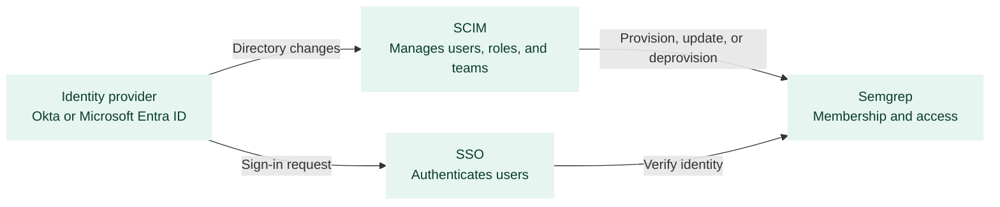

<Note>
SCIM provisioning is in **beta**. Beta features are subject to change based on continued internal benchmarking and customer feedback. To join the beta, contact your Semgrep account team or [<Icon iconType="regular"/> support@semgrep.com](mailto:support@semgrep.com).
</Note>

System for Cross-domain Identity Management (SCIM) lets you provision, update, and deprovision members of your Semgrep deployment from your identity provider (IdP). You can also use identity provider groups to assign deployment roles and, optionally, manage Semgrep teams.

SCIM keeps user access and membership synchronized between your IdP and Semgrep. For example, when you add, update, or remove a user in your IdP, SCIM applies the corresponding change in Semgrep automatically.

SCIM manages user access, while [SSO](/deployment/sso) manages authentication. You must configure SSO authentication before setting up SCIM.

This article covers SCIM provisioning setup. Only the Okta and Microsoft Entra ID workflows documented here are tested and supported during the beta.

## What SCIM manages

With SCIM enabled, Semgrep supports:

- **User provisioning**: Create Semgrep members when users are assigned to the Semgrep application in your IdP.
- **Profile updates**: Update member profile attributes when they change in your IdP.
- **Deprovisioning**: Remove Semgrep access when users are unassigned or deactivated in your IdP.
- **Deployment role assignment**: Map IdP groups to Semgrep roles such as **Admin**, **Member**, or **Read-only**.
- **Team creation from IdP groups** (optional): When [Teams (beta)](/deployment/teams/overview) is enabled, IdP groups that follow Semgrep's `[team]` naming convention can create Semgrep teams for project-scoped access.

Members provisioned through SCIM are matched and managed by email address. Users who predated the directory connection are matched to existing Semgrep accounts when they use the same SSO connection.

## How SCIM works with SSO

SCIM and SSO share your IdP and Semgrep deployment. SSO handles sign-in; SCIM handles membership and roles between sign-ins. Relying on SSO alone often means role and membership changes only apply after the user signs in again.

SSO and SCIM work together but serve different purposes:

| Capability | SSO | SCIM |
| :--- | :--- | :--- |
| User signs in with corporate credentials | Yes | No. SCIM doesn't replace login |
| Create Semgrep accounts when users are added in the IdP | Only with just-in-time (JIT) provisioning at login | Yes, before the user signs in |
| Update roles when IdP group membership changes | Only after the user signs in again | Yes, typically within about a minute |
| Deactivate access when a user is removed in the IdP | Depends on JIT behavior | Yes, when the IdP deprovisions the user |

## Prerequisites

Before you set up SCIM, confirm you have the following:

- A Semgrep plan that includes SSO. Contact your Semgrep account team if you are unsure whether your plan includes SSO.
- [SSO configured and active](/deployment/sso) in your deployment.
- [Admin privileges](/deployment/teams/overview#roles-and-access) for your Semgrep deployment.
- Permission in your identity provider to manage the Semgrep application. See [SCIM provisioning with Okta](/kb/semgrep-appsec-platform/scim-okta#prerequisites) or [SCIM provisioning with Microsoft Entra ID](/kb/semgrep-appsec-platform/scim-microsoft-entra-id#prerequisites) for provider-specific requirements.
- Optional: Enable [Teams (beta)](/deployment/teams/overview) only if you want SCIM to create and manage Semgrep teams from IdP groups. Teams isn't required for user provisioning or deployment-level role mapping.

## Set up SCIM

Start in Semgrep AppSec Platform, then complete setup in your identity provider using the IdP-specific article.

<Steps>
<Step>
Sign in to [Semgrep AppSec Platform](https://semgrep.dev/login) as an admin.
</Step>
<Step>
Go to [**Settings > Access > Login methods**](https://semgrep.dev/orgs/-/settings/access/loginMethods).
</Step>
<Step>
Click **Set up** to launch the **Directory Setup Portal**.
</Step>
<Step>
Select your IdP (**Okta** or **Microsoft Entra ID**).
</Step>
</Steps>

The Directory Setup Portal walks you through creating or linking an application, configuring provisioning, assigning users and groups, mapping groups to roles, and testing the directory connection. Provider-specific steps differ; follow the complete workflow in the IdP-specific article.

<CardGroup>
  <Card title="SCIM provisioning with Okta" icon="shield-check" href="/kb/semgrep-appsec-platform/scim-okta" horizontal />
  <Card title="SCIM provisioning with Microsoft Entra ID" icon="shield-check" href="/kb/semgrep-appsec-platform/scim-microsoft-entra-id" horizontal />
</CardGroup>

## Verify the connection

After you finish the setup workflow in your IdP, confirm that SCIM connection status shows **Active** under **Identity management (SCIM)** on the [**Login methods**](https://semgrep.dev/orgs/-/settings/access/loginMethods) page.

To reopen the Directory Setup Portal later, go to **Login methods**, find **Identity management (SCIM)**, and click **View**.

## Manage deployment roles

During directory setup, or later by reopening the portal, map role groups to Semgrep deployment roles:

<Steps>
<Step>
Go to [**Settings > Access > Login methods**](https://semgrep.dev/orgs/-/settings/access/loginMethods).
</Step>
<Step>
Under **Identity management (SCIM)**, click **View** to open the Directory Setup Portal.
</Step>
<Step>
Click **Configure role assignment**.
</Step>
<Step>
For each role-mapping group, select the Semgrep role from the **Role** drop-down. Don't assign roles to team groups suffixed with `[team:<role>]`.
</Step>
</Steps>

<Note>
**DEFAULT ROLE**

New SCIM-provisioned users receive the **Member** role until they belong to a role-mapped group. When a user belongs to multiple role-mapped groups, Semgrep assigns the highest-privilege role among those groups.
</Note>

## Manage teams with SCIM

If [Teams (beta)](/deployment/teams/overview) is enabled, SCIM can create and manage Semgrep teams from IdP groups. Teams isn't required for user provisioning or deployment-level role mapping.

### Group naming

To create a Semgrep team from an IdP group, add `[team]` or `[team:<role>]` to the end of the group name:

| Example group name | Semgrep team | Team role |
| :--- | :--- | :--- |
| `Team 1 [team]` | Team 1 | **Member** (default) |
| `Team 1 [team:manager]` | Team 1 | **Manager** |
| `Team 1 [team:member]` | Team 1 | **Member** |
| `Team 1 [team:readonly]` | Team 1 | **Read-only** |

Don't assign deployment roles to team groups in the Directory Setup Portal. See [SCIM provisioning with Okta](/kb/semgrep-appsec-platform/scim-okta#manage-teams) or [SCIM provisioning with Microsoft Entra ID](/kb/semgrep-appsec-platform/scim-microsoft-entra-id#manage-teams) for provider-specific team management steps.

### Identity-provider group behavior

How you assign and sync groups depends on your identity provider:

- **Okta** separates application **Assignments** and **Push Groups**. Use assignment groups to provision users into the deployment, and separate push groups for deployment role mapping and teams. Don't use the same group for both. See [Understand assignments and push groups](/kb/semgrep-appsec-platform/scim-okta#understand-assignments-and-push-groups) in the Okta article.
- **Microsoft Entra ID** uses **group assignment** to the Semgrep enterprise application for provisioning, deployment role mapping, and team creation. There is no separate push-groups workflow. Review group membership before assignment, because assigning a group provisions all of its members. See [Understand group assignments](/kb/semgrep-appsec-platform/scim-microsoft-entra-id#understand-group-assignments) in the Entra ID article.

## Limitations

While this feature is in beta, the following limitations apply:

- Only Okta and Microsoft Entra ID workflows are supported.
- Once SCIM is active, you can't manage SSO users or teams through Semgrep AppSec Platform.
- SCIM updates aren't instantaneous. Okta changes can take up to a minute; Entra ID uses a 40-minute provisioning cycle by default unless you **Provision on demand**.
- Sub-teams and team-managed projects can't be controlled through SCIM.
- Disabling SCIM doesn't deprovision members from the deployment.
- SCIM applies to one Semgrep deployment. Don't share a single SAML/SCIM application across multiple deployments.

For provider-specific behavior and edge cases, see [Okta](/kb/semgrep-appsec-platform/scim-okta#okta-specific-behavior-and-limitations) and [Entra ID](/kb/semgrep-appsec-platform/scim-microsoft-entra-id#entra-id-specific-behavior-and-limitations).

## Disable SCIM

Disabling SCIM disconnects directory sync and removes the connected directory configuration from Semgrep. Disabling SCIM doesn't deprovision members from the deployment.

<Warning>
**WARNING**

Before you disable SCIM, confirm that admins can still sign in through SSO and that you have a plan to manage members who were SCIM-provisioned.
</Warning>

<Steps>
<Step>
Sign in to [Semgrep AppSec Platform](https://semgrep.dev/login) as an admin.
</Step>
<Step>
Go to [**Settings > Access > Login methods**](https://semgrep.dev/orgs/-/settings/access/loginMethods).
</Step>
<Step>
Under **Identity management (SCIM)**, disable SCIM and confirm.
</Step>
</Steps>

## See also

<CardGroup>
  <Card title="SSO authentication" icon="shield-check" href="/deployment/sso" horizontal />
  <Card title="Teams and users" icon="users" href="/deployment/teams/overview" horizontal />
  <Card title="Manage teams and roles" icon="users-gear" href="/deployment/teams/manage" horizontal />
  <Card title="SAML SSO with Microsoft Entra ID" icon="shield-check" href="/kb/semgrep-appsec-platform/saml-microsoft-entra-id" horizontal />
</CardGroup>
