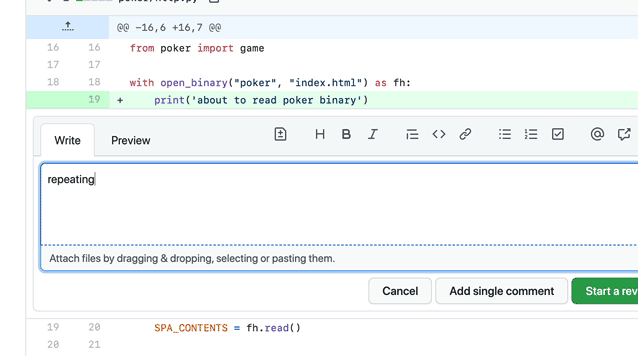

# Getting started with Semgrep CLI

## Running Semgrep locally

Start by running [Semgrep](https://github.com/returntocorp/semgrep/) locally to scan your code. Semgrep runs offline on uncompiled code. **No code leaves your computer**.

1. Install Semgrep. Use one of the following options depending on your system and preference:
    - For macOS:
        ```sh
        brew install semgrep
        ```
    - For Ubuntu, Windows through Windows Subsystem for Linux (WSL), Linux, macOS:
        ```sh
        python3 -m pip install semgrep
        ```
    - To try Semgrep without installation run through Docker:
        ```sh
        docker run --rm -v "${PWD}:/src" returntocorp/semgrep semgrep --config=auto
        ```
2. Confirm installation by printing help manual page to your terminal. To do so, run the following command:
    ```sh
    semgrep --help
    ```
3. Automatically survey languages and frameworks and run recommended Semgrep Registry rules:
    ```sh
    semgrep --config=auto path/to/src
    ```
4. Optional: Check for Python `==` where the left and right sides are the same (this is often a bug):
    ```sh
    semgrep -e '$X == $X' --lang=py path/to/src
    ```

:::note
* `--config auto` sends your repository's project URL to [Semgrep Registry](https://semgrep.dev/r) to find rules configured for your repository and as a key for cached rule recommendations.
* When Semgrep Registry is used, [usage metrics](../metrics) are collected by default.
:::

### Next steps

Here are some additional resources you may use:

- See [CLI Reference](../cli-reference/) for command line options and exit codes.
- Visit [Running rules](../running-rules/) to learn more or try Semgrep on known vulnerable test projects:

<details><summary>Expand for sample projects! 🎉</summary>
<p>

These community projects are designed to test code scanners and teach security concepts. Try cloning and scanning them with Semgrep.

```sh
# juice-shop, a vulnerable Node.js + Express app
git clone https://github.com/bkimminich/juice-shop
cd juice-shop
semgrep --config=auto

# or if you don't have Semgrep installed, replace the semgrep command with:
docker run --rm -v "$(pwd)/juice-shop:/src" returntocorp/semgrep semgrep --config p/security-audit /src

# railsgoat, a vulnerable Ruby on Rails app
git clone https://github.com/OWASP/railsgoat
cd railsgoat
semgrep --config=auto

# govwa, a vulnerable Go app
git clone https://github.com/0c34/govwa
cd govwa
semgrep --config=auto 

# vulnerable Python + Flask app
git clone https://github.com/we45/Vulnerable-Flask-App
cd Vulnerable-Flask-App
semgrep --config=auto 

# WebGoat, a vulnerable Java + Spring app
git clone https://github.com/WebGoat/WebGoat
cd WebGoat
semgrep --config=auto 
```

</p>
</details>

## Writing a rule

Once Semgrep is running locally, see the [Semgrep Tutorial](https://semgrep.dev/learn) to learn how to write precise rules to check your code.

Semgrep rules can cover a wide range of use cases:

- Automating code review comments.
- Detecting secure coding violations.
- Detecting API routes, database models, or similar code segments.
- Identifying authentication violations.
- Lightweight vulnerability detection.
- Scanning configuration files.
- And more! Check out more use cases [here](../writing-rules/rule-ideas/).

Visit [Writing Rules > Getting started](../writing-rules/overview/) for an in-depth guide and reference material.

This rule is used to find and discourage `print(...)` in production code. You can edit this rule here or visit the [Playground](https://semgrep.dev/editor) to write and deploy your own rule.

<iframe title="Semgrep example with Python Flask routes" src="https://semgrep.dev/embed/editor?snippet=ievans:print-to-logger" width="100%" height="432px" frameBorder="0"></iframe>
<br /><br />



<br />
<p>A reviewer writes a Semgrep rule and adds it to an organization-wide policy.
</p>

## Run Semgrep continuously

Semgrep is at its best when used to continuously scan code.
Check out [Semgrep CI](../semgrep-ci/overview/) to learn how to get results where you already work:
GitHub, GitLab, Slack, Jira, and more.
To get results even earlier in the development process,
such as in a Git pre-commit hook or VS Code,
check the available [Semgrep extensions](../extensions/).

For teams running Semgrep on multiple projects, see [Semgrep App](https://semgrep.dev/manage). Its free and paid tiers let users:

1. Centrally define code standards.
2. Monitor the impact of standards.
3. Host private rules.
4. Push notifications to 3rd-party services.

## Upgrading

We [release new Semgrep versions](https://github.com/returntocorp/semgrep/releases) often! See [upgrading](../upgrading/) for more details.
