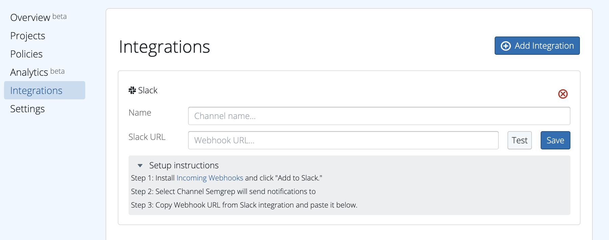
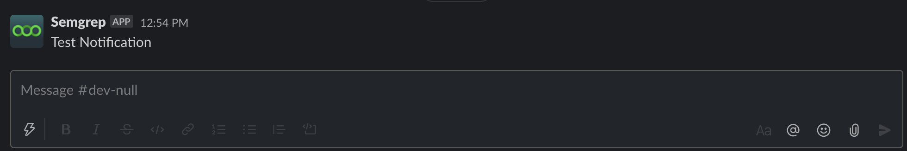
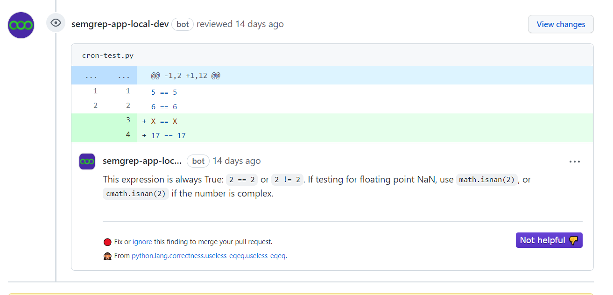

# CI Integrations

Semgrep CI provides integrations with 3rd party services like Slack and GitHub. When integrations are configured, you can receive notifications about Semgrep CI findings and failures. To configure these and learn more, visit [Dashboard > Integrations](https://semgrep.dev/manage/integrations).

- [CI Integrations](#ci-integrations)
  - [Slack](#slack)
  - [Email](#email)
  - [Pull request comments](#pull-request-comments)

### Slack

To receive Slack notifications about Semgrep findings on pull requests and code pushes, visit [Dashboard > Integrations](https://semgrep.dev/manage/integrations) and select 'Add integration' or 'Setup First Integration' and then choose 'Slack'. Give your channel a name, and then follow the setup instructions on the page to retrieve your Webhook URL.



Use the 'Test' button to send a test notification and ensure that your channel is configured properly.



### Email

To receive email notifications about Semgrep findings on pull requests and code pushes, visit [Dashboard > Integrations](https://semgrep.dev/manage/integrations) and select 'Add integration' or 'Setup First Integration,' and then choose 'Email'. Enter your email address, give the channel a name of your choosing, and then click 'Save'.

On each scan that has at least one finding, you will receive one email from Semgrep with a summary of all of the findings from that scan.

### Pull request comments

<!-- prettier-ignore-start -->
!!! info
    This feature is currently only available for GitHub.
<!-- prettier-ignore-end -->

Pull request comments are left when

1. Semgrep finds a result in CI, and
2. [the CI policy has pull request comments enabled](managing-policy.md#changing-policy-actions)

Automated comments on GitHub pull requests look like this:



Note that [Semgrep App](https://semgrep.dev) uses the permissions requested by [the Semgrep GitHub App](https://github.com/marketplace/semgrep-dev) to leave PR comments.

If you are using Github Actions to run Semgrep, no extra changes are needed to get PR comments. If you are using another CI provider, in addition to the environment variables you set after following [sample CI configurations](sample-ci-configs.md) you need to ensure that the following environment variables are correctly defined:

- `SEMGREP_COMMIT` is set to the full commit hash of the code being scanned (e.g. `d8875d6a63bba2b377a57232e404d2e367dce82d`)
- `SEMGREP_PR_ID` is set to the PR number of the pull request on Github (e.g. `2900`)
- `SEMGREP_REPO_NAME` is set to the repo name (e.g. `returntocorp/semgrep`)

### Webhooks

Webhook notifications are a paid feature in our Semgrep Team tier.

To receive webhook notifications about Semgrep findings on pull requests and code pushes, visit [Dashboard > Integrations](https://semgrep.dev/manage/integrations) and select 'Add integration' or 'Setup First Integration,' and then choose 'Webhook'. Enter a target URL, give the notification channel a name of your choosing, and then click 'Save'.

The URL will receive a POST request for each new finding.
If one scan returns eight findings, eight separate requests will be sent.
The body of the payload will be a JSON object that looks like this:

```json
{
  "semgrep_finding": {
    "id": "241dbe518caf15f800131d2d0c70bf08",
    "mute_date": null,
    "assigned_date": null,
    "assigned_by_user_id": null,
    "ref": "refs/pull/2658/merge",
    "start_date": "None",
    "fix_date": null,
    "end_date": null,
    "check_id": "log-exc-info",
    "path": "server/semgrep_app/handlers/registry.py",
    "line": 185,
    "column": 9,
    "message": "Error messages should be logged with `exc_info=True` in order to propagate\nstack information to Sentry. Either change the logging level or raise an Exception.\n",
    "severity": 1,
    "index": 0,
    "end_line": 187,
    "end_column": 10,
    "commit_date": "2021-06-07T15:26:35+03:00",
    "metadata": {
      "dev.semgrep.actions": [],
      "semgrep.policy": {
        "id": 8168,
        "name": "Web Apps Notify Only",
        "slug": "web-apps-notify-only"
      },
      "semgrep.ruleset": "johndoe:log-exc-info",
      "semgrep.url": "https://semgrep.dev/s/johndoe:log-exc-info"
    }
  }
}
```
