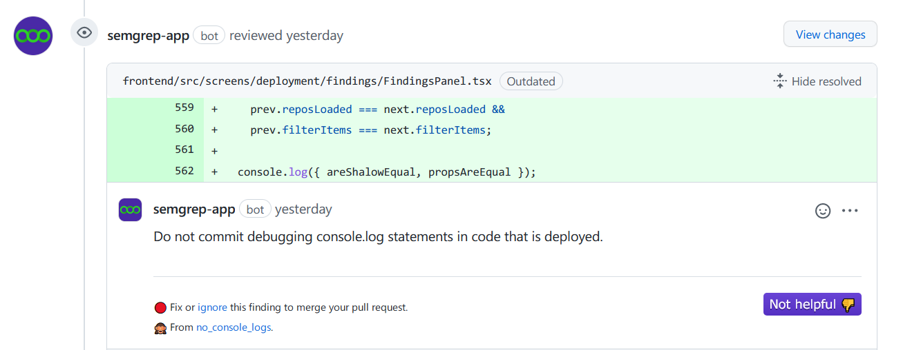

# Integrations

Semgrep provides integrations with 3rd party services at every stage of the code-writing pipeline. 

- [Editor](#editor)
- [Pre-commit](#pre-commit)
- [Slack](#slack)
- [Email](#email)
- [PR Comments](#pr-comments)

## Editor

Semgrep supports Microsoft Visual Studio Code with the [semgrep-vscode](https://marketplace.visualstudio.com/items?itemName=semgrep.semgrep) extension.

## Pre-commit

The [pre-commit framework](https://pre-commit.com/) can run `semgrep` at commit-time. [Install `pre-commit`](https://pre-commit.com/#install) and add the following to `.pre-commit-config.yaml`

```
repos:
- repo: https://github.com/returntocorp/semgrep
  rev: 'v0.39.1'
  hooks:
    - id: semgrep
      # See semgrep.dev/rulesets to select a ruleset and copy its URL
      args: ['--config', '<SEMGREP_RULESET_URL>', '--error']
```

## Slack

To receive Slack notifications about Semgrep findings on pull requests and code pushes, visit [Dashboard > Integrations](https://semgrep.dev/manage/notifications) and select 'Add integration' or 'Setup First Integration' and then choose 'Slack'. Give your channel a name, and then follow the setup instructions on the page to retrieve your Slack URL. 


Use the 'Test' button to send a test notification and ensure that your channel is configured properly.


## Email

To receive email notifications about Semgrep findings on pull requests and code pushes, visit [Dashboard > Integrations](https://semgrep.dev/manage/notifications) and select 'Add integration' or 'Setup First Integration,' and then choose 'Email'. Enter your email address, give the channel a name of your choosing, and then click 'Save'.

On each scan that has at least one finding, you will receive one email from Semgrep with a summary of all of the findings from that scan.

## PR Comments

!!! info
    This feature is currently only available for GitHub. There’s no need to create `secrets.GITHUB_TOKEN` yourself because it’s automatically set by GitHub. It only needs to be passed to the action via the workflow file.

Comments are left when a Semgrep rule finds a result, the policy that contained the rule had [PR Comments](managing-policy.md#changing-policy-actions) selected, and a GITHUB_TOKEN is configured.

```
uses: returntocorp/semgrep-action@v1
        env: # Optional environment variable for automatic PR comments
          GITHUB_TOKEN: ${{ secrets.GITHUB_TOKEN }}
```

See a complete example of this workflow file including this environment variable (commented out) in the [CI Providers](sample-ci-configs.md#github-actions) section.

Automated comments on GitHub pull requests will look like this:



## Semgrep as an engine

Many other tools have functionality powered by Semgrep.
Add yours [with a pull request](https://github.com/returntocorp/semgrep-docs)!

* [nodejsscan](https://github.com/ajinabraham/nodejsscan)
* [libsast](https://github.com/ajinabraham/libsast)
* [DefectDojo](https://github.com/DefectDojo/django-DefectDojo/pull/2781)
* [Dracon](https://github.com/thought-machine/dracon)
* [SALUS](https://github.com/coinbase/salus/blob/master/docs/scanners/semgrep.md)
