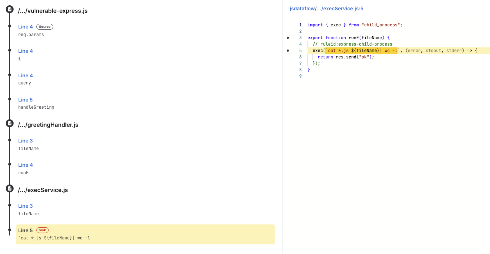

# Understanding Static Code Scanning Tools: What is SAST?

A [Static Application Security Testing (SAST)](https://semgrep.dev/products/semgrep-code?utm_source=devrel&utm_medium=referral&utm_campaign=2025-devto-blog) tool can analyze your code without executing it, scanning for potential security vulnerabilities, bugs, and code quality issues early in the development process. SAST tools examine source code acting as an automated security expert, reviewing each line of code. This doesn’t replace human review but helps accelerate the discovery of vulnerabilities and the confidence in code being ready for release.

Some key features of a good SAST tool:

- The static analysis engine should **support whole program taint analysis** which tracks the ****flow of tainted data such as untrusted user input and any expressions that operate upon it that may be exploited.
- **Support many programming language and frameworks** used during development, this includes core programming languages, infrastructure as code, and scripts
- Work and **integrate seamlessly with any existing developer tooling** like IDEs, pre-commit, PR/MR comments, CI/CD pipelines, etc. Finding data should be exportable into common formats such as proprietary JSON, SARIF, or CSV so information can be sent to vulnerability management systems and for viewing metrics/trends overtime.
- Support **easy to create customization**, which is crucial to be able to detect vulnerabilities for internally developed libraries and frameworks that out-of-the box solutions would miss.
- When an issue is discovered, **provide detailed remediation** **guidance** **and code auto-fixing** capabilities helps reduce the time to remediate

We can explore how this works in Source Code Analysis & Taint Tracking.

## Source Code Analysis & Taint Tracking

Static analysis tools perform many types of analysis, but a comprehensive taint analysis engine is essential for any SAST solution. Taint analysis is a data-flow analysis technique that tracks untrusted or **tainted data** as it moves through a function or method. This tainted data originates from **sources** such as user input. When tainted data isn't properly checked or sanitized, the analysis reports an issue whenever this data reaches a vulnerable function, known as a **sink**. 

An example of **sources**:

- HTTP request parameters
- Cookie values
- Database query results
- File uploads

An example of **vulnerable** **sinks**:

- SQL query execution functions
- Command execution methods like **exec()** or **system()**
- HTML rendering functions
- File Input/Output system operations
- Serialization/deserialization methods

Just finding the usage of a vulnerable function such as `exec(...)` could uncover issues, but that will produce a significant amount more of false positives than being able to reason through findings which come from actionable locations such as user-controlled input.

## Broad Language Support

Modern development teams don’t use just one language, your SAST solution should be capable of handling all of the modern languages you use daily to write and deploy software. With this in mind, your SAST tool should have support for your existing development practices by integrating into existing tools:

- Cover the common programming languages in your organization usages e.g. C++, Java, JavaScript, Typescript, Golang, etc
- Frameworks for common languages such as Flask, Django, Express, Spring, Next.js, React, etc should also be supported
- Support infrastructure as code languages such as Jsonnet, Terraform, Docker, etc
- Provide a default-ruleset that covers common vulnerabilities specific to those supported languages
- Support community driven rules to help increase coverage for a variety of languages that may not be in the default ruleset

## Incorporating Security Testing Into Your Workflow

To get teams to action on SAST findings they need to be surfaced in the places people will look at them, which is your development and deployment workflows.  

### Local Development

Getting vulnerabilities in-front of developers as code is being written will lead to vulnerabilities being resolved before they are even pushed to a source-code management system such as GitHub. A SAST solution should be a fast feedback loop on developers local machines otherwise it won’t be used and will be usually circumvented to enable developer velocity, the places you can enforce SAST during local development are:

- Having IDE support, developers are more likely to resolve issues in their IDE, they are more likely to fix the issue if the warning is showing up the code they have just written
- The ability to trigger a scan manually via the CLI
- Offering a local or remote MCP server when leveraging LLMs to aid in local development
- Tracked changes ready to be pushed via git can be quickly scanned via `pre-commit` hooks these can be set-up to fail for specific rules or categories of issues
- Before the server accepts incoming PRs, if supported you can also perform quick-scans via `pre-receive` hooks if the platform supports it which will help before others may review the PRs which will be one less issue for them to review

### Integrations

Once code has been pushed to remote repositories you can configure SAST solutions to perform either fast, or more thorough in-depth scan configurations to ensure 

- Integrate with Source code management (SCM) platforms to automatically comment on pull/merge requests
- Configureable CI/CD scan configurations before release
- Full codebase scans for thorough coverage

For reporting purposes, you may want to also ensure findings are sent to a platform that can be used to track issues over time, and integrate for reporting or compliance:

- Results should be exportable to standardized formats (SARIF, JSON, CSV) for integration with other tools such as vulnerability management systems or ASPMs
- Findings should be configurable to send to a centralized dashboard so findings can be tracked over time
- Have the ability to send findings to teams via ticketing systems such as Jira and Linear
- Have the ability to trigger webhooks or send notifications via slack or teams with new vulnerabilities

## Customization

Being able to write custom rules helps with edge-cases where internal knowledge is needed to be able accurately report if something is a security vulnerability or code smell for example:

- Your developers keep seeing the same issue get introduced into a codebase and want to prevent further additions
- You received a bug bounty report and want to ensure that the issue does not exist in other parts of your product or re-surface in the future
- Your internally written library exports a method e.g. `evaluateAndRespond` that executes code once called
- A custom `security.json` file needs to include `"encyrpt": true` for all new entries
- You want to ban any calls to a library you wrote 10 years ago, and get all code repositories to migrate to a new library
- You have created a custom HTTP request library that you want to track that as a source if any request parameters enter dangerous sink locations that lead to SQL Injection or SSRF

Without the ability to customize your SAST tool, it will be treated more like a check-box exercise for regulatory purposes, where a SAST tool should enable your developers and security teams to internally detect and reduce risk at scale.

## Fix Guidance

You won’t know how to fix a vulnerability out-right without already understanding the problem it introduces, so detection alone doesn’t always cut it. Your SAST solution should provide:

- Default remediation advice which explains common ways to resolve the problem for the language you are working in
- The ability to extend the guidance to link to internal documentation, suggest libraries, or provide code examples of how you solve this within your organization
- Have [auto-fix](https://semgrep.dev/docs/writing-rules/autofix) capabilities that can automatically fix the vulnerability in the susceptible piece of code
- Integrate with LLMs to provide contextual remediation guidance and code fix suggestions