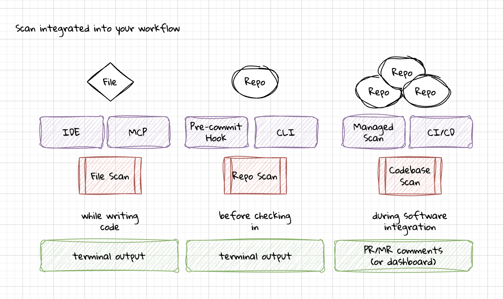

# Incorporating Security Testing Into Development Workflows

We have more security tools than ever, yet vulnerabilities continue to get introduced. The real problem isn’t detection, it is prevention at scale. We need to enable developers with the right tools, features, and integrations. Effective security tools meet developers where they are; in their code editors, code repositories, and ticketing systems. They are fast, accurate, and provide actionable feedback.

## Keeping developers in their workflows

Security and development teams have historically experienced friction. Developers often view security as a blocker that slows down their work, while security teams see themselves as protecting the integrity of the codebase. To make security effective, it needs to meet developers where they already work, rather than forcing them to adopt new, disconnected processes.

The DevOps movement offers a valuable lesson here: when speed and automation are prioritised, adoption improves dramatically. Security can follow the same path by focusing on accuracy and seamless integrations. The goal for security testing tools is to provide fast, precise feedback that helps developers fix issues without interrupting their flow.

## Security tools and their features

A variety of security tools are available to support developers, each addressing a different risk area. Static Application Security Testing (SAST) helps identify vulnerabilities in source code. Software Composition Analysis (SCA) monitors open-source dependencies for known vulnerabilities. Secret scanning ensures that sensitive information such as API keys or credentials is not accidentally committed to repositories.

For these tools to be truly useful, they must go beyond simply flagging issues. 

- **Rule customization** is essential so teams can focus on findings that are relevant to their environment.
- Effective tools also provide **remediation guidance**, offering developers clear, actionable steps to resolve problems rather than just pointing them out.

Research has shown that customizable rules with active remediation guidance greatly improve the developer experience and result in higher fix rates [1-4].

## Integration into developer workflows

### Local development

The most powerful place to integrate security testing is directly into the developer’s daily environment.

- **IDE Integration:** Providing real-time feedback inside the IDE allows developers to see issues as they type and receive inline fix suggestions. Research has shown that this approach can increase fix rates dramatically, in some cases up to 98% [1-3].
- **CLI and Manual Scans:** Developers who prefer command-line workflows can run deeper, on-demand scans before committing their code.
- **Pre-commit Hooks:** Serving as the last line of defense before code enters source control, pre-commit hooks can be configured to block commits only when rules are proven to be highly accurate for a given codebase.
- **MCP Server Integration:** As AI-assisted coding becomes more common, integrating security checks directly into model-context protocol (MCP) servers ensures that LLM-generated code is automatically reviewed with context-aware security suggestions.

### CI/CD Pipeline

Security checks in the CI/CD pipeline provide additional layers of assurance without disrupting the developer’s inner loop.

- **Pre-receive Hooks:** Depending on platform support, these serve as a final gate before code reaches the main branch.
- **SCM Integration Features:** Diff-aware scanning helps security tools focus on newly changed code, while automated comments on pull requests give developers immediate feedback. Status checks can also block merges for specific high-confidence rules.
- **Build Integration:** Teams can choose between incremental scans for speed or full scans for comprehensive coverage, depending on the stage of the build.

### Reporting and Tracking

Security findings need to be tracked and communicated effectively to avoid becoming noise.

- **Output Formats:** Supporting common formats such as SARIF, JSON, CSV, and SBOM ensures compatibility with other systems.
- **Dashboard Requirements:** Dashboards should go beyond raw counts of vulnerabilities, offering trend analysis, mean time to remediation (MTTR), vulnerability density metrics, and adoption rates among developers. They should also make it easy to triage findings, and update rules to increase confidence.
- **Team Communication:** Automated workflows ensures the right findings are prioritized and fixed within the required timeframes. The tool should integrate with the ticketing system, like Jira or Linear. It could also be enabled to send notifications to Slack or Teams, or even used for triggering webhooks for custom integrations.

## Conclusion

Security testing becomes effective when it feels like a natural extension of a developer’s workflow. Tools should be integrated directly into environments like the IDE, not added as external hurdles. Feedback must be tuned for accuracy and presented with actionable guidance so that developers can resolve issues quickly without slowing down. Ultimately, the most effective security tool is the one that developers actually use.

### References

[1] De Cremer, Pieter. *The paved path methodology: a human-centered approach to software security*. Diss. Ghent University, 2021.

[2] Sadowski, Caitlin, et al. "Tricorder: Building a program analysis ecosystem." 2015 IEEE/ACM 37th IEEE International Conference on Software Engineering. Vol. 1. IEEE, 2015.

[3] De Cremer, Pieter, et al. "Sensei: Enforcing secure coding guidelines in the integrated development environment." *Software: Practice and Experience* 50.9 (2020): 1682-1718.

[4] Xie, Jing, et al. "ASIDE: IDE support for web application security." *Proceedings of the 27th Annual Computer Security Applications Conference*. 2011.