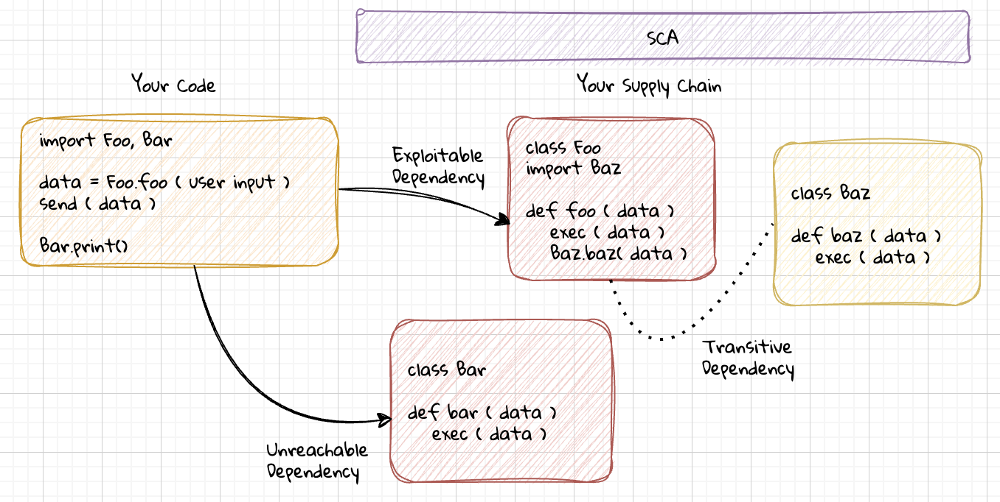

If you’re building software, you’re likely using packages, libraries, containers, or other dependencies maintained by someone else. That convenience comes with a cost. Any weakness in the software supply chain is a potential path for compromise. Attackers exploit this growing web of third-party code, public registries, and automated build pipelines that make up the modern development stack. And because the code you depend on isn’t yours, these weaknesses are harder to find and fix.

**Supply Chain Security** is the practice of understanding and remediating those security issues. If your application depends on external code, your security does too.

In this article, we’ll explore what supply chain security actually means. First, we’ll look at how third-party code becomes part of your application. Then, we’ll examine the risks—from known vulnerabilities to dependency confusion. Finally, we’ll walk through how modern tools like Semgrep Supply Chain can help you detect, prioritize, and fix issues in your third-party codebase.

## What Is Supply Chain Security?

Supply chain security refers to securing all the components that contribute to building and running your software. This includes third-party libraries, system packages, build tools, container images, and the registries they come from. We use these components to speed up development, but in doing so, we inherit their bugs and vulnerabilities.

To manage that risk, organizations rely on a practice called **Software Composition Analysis (SCA)**. SCA tools examine which packages your application uses, what known issues exist in those packages, and whether those issues affect your code in practice. A good SCA tool doesn’t just surface a list of **CVEs (Common Vulnerabilities and Exposures)**, it helps you triage, prioritize, and fix them. SCA tools commonly encompass security, software licensing compliance, reliability, and more.

The challenge with supply chains is that dependency graphs are complex. Most modern apps don’t just include a few libraries, they include hundreds. Many of those are **transitive dependencies**: code that your code relies on *indirectly*, through other packages. These transitive dependencies often go unnoticed, but they carry just as much risk because the impacts of a compromise can be exponential.

Dependencies are commonly managed through two key files:

- **Manifest files** describe which packages your application needs. This includes files like JavaScript's package.json or Python's requirements.txt.
- **Lockfiles** record exactly which versions of dependencies were installed, including transitive dependencies. This includes files like Yarn's yarn.lock or NPM's package-lock.json.

Often, SCA tools may produce an artifact known as a **Software Bill of Materials (SBOM)**. This file enumerates the libraries, tools, code, and often software license and security status of components. These can be important deliverables for compliance purposes for agreements around acceptance of security and legal risk.

Together, these all these files help define your software supply chain—and they’re what security tools analyze to understand your dependency tree.

## Why Supply Chain Vulnerabilities Matters

When a vulnerability is found in a package you use, your first question is usually: “Is this actually a problem for me?” That’s where **reachability** and **exploitability** come in.

### What is Reachability?

A vulnerable function might exist in a library, but if your code never calls that function, it’s not reachable. Similarly, even if your code does call it, proper input validation or authentication checks might mean it’s not exploitable. Understanding this difference is critical for prioritizing what to fix first.

This is what makes SCA challenging. Most tools will tell you what’s vulnerable, but not whether it matters. That’s why many security engineers spend hours manually investigating vulnerabilities. They look for references in the code, study input and output patterns, and try to reproduce exploits. When you’re dealing with hundreds of packages, this manual triage doesn’t scale very well. 

Reachability is purely hypothetical; even if a vulnerability is reachable, it may not actually be exploitable. Exploitability is a practical assessment because user input might be properly sanitized, access controls may block entry points, etc.

Tools like [Semgrep Supply Chain](https://semgrep.dev/products/semgrep-supply-chain) help by using static analysis to detect whether vulnerabilities are actually reachable from your code. This drastically reduces false positives and lets you focus on what’s truly risky.

## Real-World Risks in the Software Supply Chain

Let’s look at some of the ways supply chain vulnerabilities show up in practice.

### Known vulnerabilities in dependencies
These are the classic CVE-style issues. An old version of a library has a known bug—like a [command injection](/learn/vulnerabilities/command-injection) or path traversal—and your application still uses that version. This is surprisingly common, and usually easy to fix once identified.

### Dependency confusion
If your internal package shares a name with a public package, and your build system pulls from the public registry first, an attacker can publish a malicious version and have it installed instead. This risk is higher in large organizations with a mix of public and private libraries.

### Typosquatting and malicious packages
Sometimes attackers upload packages with names that look similar to popular ones (like react1 instead of react). Other times, they intentionally submit useful-looking packages that also include malicious code. These packages can sometimes go unnoticed until they’re already used.

### Insecure registries and build systems
Even if your dependencies are safe, if you fetch them over insecure channels, or if your CI/CD pipeline isn’t locked down, attackers can inject malicious code during builds or deployment. A **package registry** is a service used for distributing software dependencies. Each programming language typically has its own registry.

- CPAN for Perl
- NPM for Javascript
- PyPi for Python
- RubyGems for Ruby
- Packagist for PHP
- and [many more](/docs/supported-languages#package-manager-support)

## Detect and Prioritize Supply Chain Issues

To reduce your security risks, the first step is visibility. You need to know which packages are part of your application, what versions you’re using, and whether any of those versions are vulnerable. Tools like Semgrep Supply Chain can scan your lockfiles and give you a detailed inventory.

From there, modern SCA goes further. Using static code analysis, you can discover whether vulnerable functions are actually used by your code. That is, whether the vulnerability is reachable. This helps triage issues more efficiently and respond to vulnerabilities that matter most.

For example, suppose the JavaScript library `lodash` has a vulnerability in a rarely-used function. If you don’t call that function, the vulnerability isn’t reachable. If you do, and user input reaches it, that’s a different story.

Traditional SCA tools stop at flagging the version. But with reachability analysis, you can decide whether to fix the issue immediately, deprioritize it, or take compensating actions.

## Best Practices for Securing Your Software Supply Chain

Securing your supply chain doesn’t mean giving up on open source. It means managing it responsibly.

### Use lockfiles and keep them under version control
Lockfiles ensure that everyone on your team uses the same versions of each dependency. This consistency is key for both reliability and security. Without lockfiles, you may think you're running one version, but your CI system or teammate may be running another. Not all languages support lockfiles so a good SCA tool has to use other techniques.

### Keep dependencies up to date
Use dependency update tools that can propose new versions regularly, and track which updates include security fixes. Many projects let dependencies drift for years, making upgrades painful and riskier. On the other end of the spectrum, automatically including the **latest** release of a dependency can also put you at risk if the supply chain was compromised. The point is to be deliberate and thoughtful to keep dependencies up to date at regular defined intervals.

### Use a reachability-aware SCA tool
Tools like Semgrep Supply Chain help cut through the noise by identifying which vulnerabilities are actually relevant to your code.

### Audit your dependency graph for unknown or untrusted code
Pay attention to where your dependencies come from, especially transitive ones. Make sure your registries and build systems are locked down and use integrity checks where possible.

### Establish a patch and response process
Have a process in place for triaging and responding to newly disclosed vulnerabilities. If a critical issue is found in a widely used library, you want to know quickly—and have a clear path to fixing it.

## Conclusion

Modern applications are built on a mountain of third-party code. That code brings speed, flexibility, and efficiency but also risk. When a vulnerability appears in a package you rely on, it becomes your problem, too.

In this article, we covered what supply chain security is, how vulnerabilities in third-party code can impact your application, how to detect and prioritize real risk using reachability analysis, and what steps you can take to secure your software supply chain.

Supply chain security isn’t about avoiding open source, it’s about using it safely. With the right tools and practices, you can build with confidence, knowing your dependencies are as secure as the code you write yourself.

To get started, try scanning your lockfiles with Semgrep Supply Chain and see which vulnerabilities actually matter to you. Third-party code isn’t going away—but with the right guardrails, it doesn’t have to be a liability.