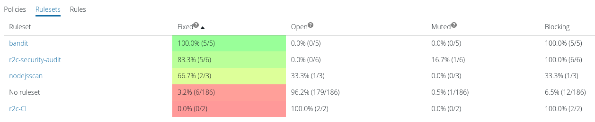

import MoreHelp from "/src/components/MoreHelp"

# Managing findings

## Findings

A finding is the core result of Semgrep's analysis. Findings are generated when a Semgrep rule matches a piece of code. After matching, a finding can make its way through 3 parts of the Semgrep ecosystem: [Semgrep](https://github.com/returntocorp/semgrep), [Semgrep CI](../semgrep-ci/overview/), and [Semgrep App](https://semgrep.dev/manage).

## Semgrep

Semgrep command line findings are produced by a specific rule matching a piece of code. Multiple rules can match the same piece of code, even if they are effectively the same rule. For example, consider the following rule and code snippet:

```yaml
rules:
- id: finding-test
  pattern: $X == $X
  message: Finding test 1
  languages: [python]
  severity: WARNING
- id: finding-test
  pattern: $X == $X
  message: Finding test 2
  languages: [python]
  severity: WARNING
```

```
print(1 == 1)
```

Running Semgrep produces the following findings:

```sh
$ semgrep --quiet --config test.yaml test.py
test.py
severity:warning rule:finding-test: Finding test 1
1:print(1 == 1)
--------------------------------------------------------------------------------
severity:warning rule:finding-test: Finding test 2
1:print(1 == 1)
```

For more information on writing rules, see [Rule syntax](../writing-rules/rule-syntax/).

## Semgrep CI

[Semgrep CI](../semgrep-ci/overview/), designed to continuously scan commits and builds, improves on Semgrep findings to track the lifetime of an individual finding. A Semgrep CI finding is defined by a 4-tuple:

```
(rule ID, file path, syntactic context, index)
```

These pieces of state correspond to:

1. `rule ID`: the rule's ID within the Semgrep ecosystem.
1. `file path`: the filesystem path where the finding occurred.
1. `syntactic context`: the lines of code corresponding to the finding.
1. `index`: an index into identical findings within a file. This is used to disambiguate findings.

:::info
`syntactic context` is normalized by removing indentation, [`nosemgrep`](../ignoring-files-folders-code) comments, and whitespace.
:::

These are hashed and returned as the syntactic identifier: `syntactic_id`. This is how Semgrep CI uniquely identifies findings and tracks them across state transitions. Semgrep CI does not store or transmit code contents. The `syntactic context` is hashed using a one-way hashing function making it impossible to recover the original contents.

## Semgrep App

Semgrep App builds on Semgrep CI findings to track state transitions and provide additional context for managing findings within your organization. Findings move between states according to their Semgrep CI `syntactic_id`, as mentioned above. A finding can occupy 4 states in Semgrep App: `OPEN`, `FIXED`, `MUTED`, `REMOVED`.

### Finding states

Semgrep App finding states are defined as follows:

1. `OPEN`: the finding exists in the code and has not been muted.
1. `FIXED`: the finding existed in the code, and is no longer found.
1. `MUTED`: the finding has been ignored by a `nosemgrep` comment or via `.semgrepignore`.
1. `REMOVED`: the finding's rule isn't enabled on the repository anymore. The rule was removed from the used ruleset, the rule was removed from the policy, or the containing policy was detached from the repo.


The possible transitions are defined as follows:

1. `Fix`: a previously identified `syntactic_id` no longer exists.
1. `Regress`: a previously fixed `syntactic_id` has been reintroduced.
1. `Mute`: a previously identified `syntactic_id` has been ignored.
1. `Unmute`: a previously muted `syntactic_id` has been unignored.
1. `Remove`: a previously identified or muted `syntactic_id`'s rule is no longer part of the scan.
1. `Readd`: a previously removed `syntactic_id`'s rule is part of the scan again.
    A readded issue can immediately be marked as fixed or muted.

:::info
    Fixed issues will stay fixed even if their rule is removed.
:::

### Analytics

Semgrep App provides analytics to measure Semgrep performance within your organization. Visit [Dashboard > Findings](https://semgrep.dev/manage/findings?tab=summary) and use measurements like fix rate and findings over time to get the most out of your Semgrep deployment:


Filter findings to drill down into specific areas:


View individual findings and their associated state:


Track high, or low, performing policies, rulesets, and rules:



:::info
The "rate" for any state is `(state total / total of all states)`, e.g., `fix rate = (fixed / (fixed + open + muted))`.
:::

For more information on blocking vs. non-blocking visit [Managing CI policy](../semgrep-app/managing-policy/).

<MoreHelp />
