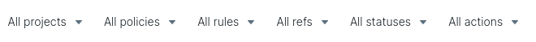
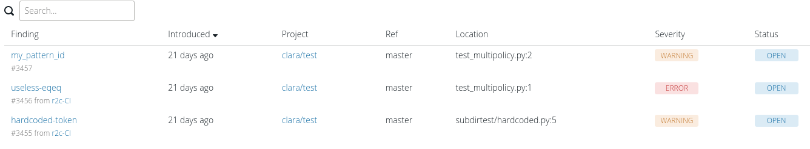

# Managing findings

[TOC]

# Findings

A finding is the core unit of Semgrep's analysis. Findings are generated when a Semgrep rule matches a piece of code. After matching, a finding can make its way through 3 parts of the Semgrep ecosystem: [`semgrep`](https://github.com/returntocorp/semgrep), [`semgrep-action`](https://github.com/returntocorp/semgrep-action), and [semgrep.dev](https://semgrep.dev/).

## Semgrep CLI

Semgrep CLI findings are a specific rule matching a piece of code. Multiple rules can match the same piece of code, even if they are effectively the same rule. For example, consider the following rule and code snippet:

```
rules:
- id: finding-test
  pattern: $X == $X
  message: Finding test 1
  languages: [python]
  severity: WARNING
- id: finding-test
  pattern: $X == $X
  message: Finding test 2
  languages: [python]
  severity: WARNING
```

```
print(1 == 1)
```

Running Semgrep CLI produces the following findings:

```
$ semgrep --quiet --config test.yaml test.py
test.py
severity:warning rule:finding-test: Finding test 1
1:print(1 == 1)
--------------------------------------------------------------------------------
severity:warning rule:finding-test: Finding test 2
1:print(1 == 1)
```

*For more information on writing rules, see [Rule syntax](writing-rules/rule-syntax.md).*

## Semgrep Action

Semgrep Action builds on Semgrep CLI findings to track the lifetime of an individual finding.

A Semgrep Action finding is defined by a 4-tuple:

```
(rule ID, file path, syntactic context, index)
```

These pieces of state correspond to:

1. `rule ID`: the rule's ID within the Semgrep ecosystem.
1. `file path`: the filesystem path where the finding occurred.
1. `syntactic context`: the lines of code corresponding to the finding.
1. `index`: an index into identical findings within a file. This is used to disambiguate findings.

!!! note
    `syntactic context` is normalized by removing indentation, [`nosemgrep`](ignoring-findings.md#ignoring-findings-via-inline-comments) comments, and whitespace.

These 4 pieces of information are then hashed and returned as the syntactic identifier: `syntactic_id`. This is how Semgrep Action uniquely identifies findings and tracks them across state transitions. Semgrep Action does not store or transmit code contents. The `syntactic context` is hashed using a one-way hashing function making it impossible to recover the original contents.

## Semgrep App

Semgrep App builds on Semgrep Action findings to track state transitions and provide additional context for managing findings within your organization. Findings move between states according to their Semgrep Action `syntactic_id`, as mentioned above. A finding can occupy 3 states in Semgrep App: `OPEN`, `FIXED`, and `MUTED`.

### Finding states

Semgrep App finding states are defined as follows:

1. `OPEN`: the finding exists in the code and has not been muted.
1. `FIXED`: the finding existed in the code, and is no longer found.
1. `MUTED`: the finding has been ignored by a `nosemgrep` comment.

Findings move between states as follows:


These transitions are defined as follows:

1. `Fix`: a previously identified `syntactic_id` no longer exists.
1. `Regression`: a previously fixed `syntactic_id` has been reintroduced.
1. `Mute`: a previously identified `syntactic_id` has been ignored.
1. `Unmute`: a previously muted `syntactic_id` has been unignored.

### Analytics

Semgrep App provides analytics to measure Semgrep performance within your organization. Visit [Manage > Analytics](https://semgrep.dev/manage/findings) and use measurements like fix rate and findings over time to get the most out of your Semgrep deployment:


Filter findings to drill down into specific areas:



View individual findings and their associated state:



Track high, or low, performing policies, rulesets, and rules:


*For more information on blocking vs. non-blocking visit [Managing CI policy](managing-policy.md).*
