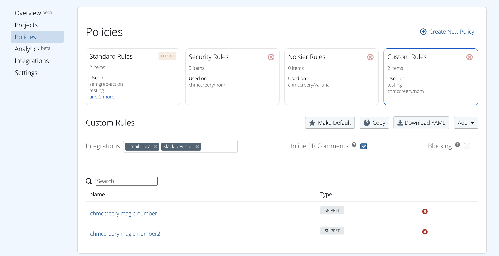
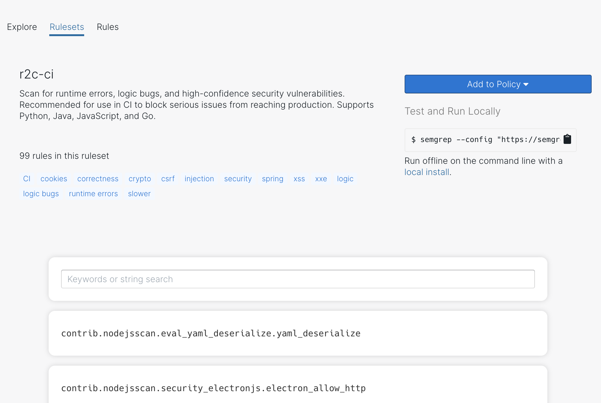
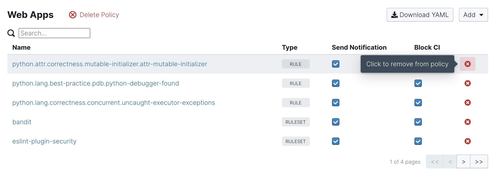

# Managing CI policy

Semgrep App provides infrastructure for managing Semgrep across many projects. Create policies from its web UI and apply those policies to projects in a many-to-many mapping. A policy is a simple collection of rules and a definition of what to do with rule results: fail the Semgrep CI run and/or send non-blocking notifications to third-party services like Slack.



[TOC]

# Creating policy

To create a policy, visit [Manage > Policies](https://semgrep.dev/manage/policy) and select “New Policy.”

Policies are often broken down by problem area (e.g., `xss`), application type (e.g., `prod-python-backend`), or blocking status (e.g., `notify-only`). There is no right way to group rules, and it changes team-to-team and organization-to-organization.

# Editing policy

Any rule, ruleset, or pattern can be added to a policy. Look for the “Add to Policy” button.



To remove or edit the settings for a rule, ruleset, or pattern, go to [Manage > Policies](https://semgrep.dev/manage/policy) and select the relevant policy. You can then remove the item using the deletion `x` or change its notification settings through the ”Send Notification” and “Block CI” checkboxes.



# Downloading policy

To locally test and run a policy, select your policy at [Manage > Policies](https://semgrep.dev/manage/policy) and use the “Download YAML” button. This YAML file can then be run locally via:

```bash
$ semgrep --config <path/to/yaml> <path/to/code>
```

!!! info
    See [Getting started](getting-started.md) for instructions on downloading and running Semgrep locally.

# Notifications

To receive notifications via third-party services, like Slack or email:

1. Visit [Manage > Notifications](https://semgrep.dev/manage/notifications) to configure the services
2. From [Manage > Policies](https://semgrep.dev/manage/policy), select the policy you’d like to configure and select “Send Notification” for the relevant rules, ruleset, or pattern.

When Semgrep CI next runs and finds a result, the configured services will receive the finding.
