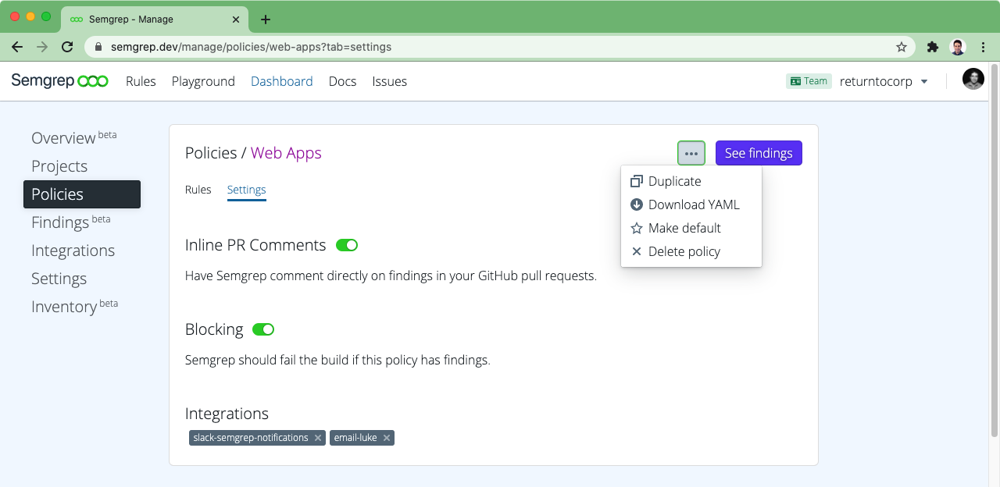

# Managing CI policy

Semgrep App provides infrastructure for managing Semgrep across many projects. Gather related rules together in "policies" and apply those policies to projects in a many-to-many mapping. A policy is simply a collection of rules, and a definition of what to do with their results: send notifications to third-party services like Slack, post inline pull request comments on GitHub, and/or block the build by returning a non-zero status.



[TOC]

# Creating a policy

To create a policy, visit [Manage > Policies](https://semgrep.dev/manage/policy) and select “Create New Policy.” To copy the contents of one policy into another, navigate to the existing policy, click "Copy", and then enter the name of the new policy.

Policies are often broken down by problem area (e.g., `xss`), application type (e.g., `prod-python-backend`), or blocking status (e.g., `notify-only`). There is no right way to group rules, and what makes the most sense will vary by team and organization.

# Editing a policy

Any rule, ruleset, or pattern can be added to a policy. Look for the “Add to Policy” button when exploring [pre-written rules and rulesets](https://semgrep.dev/explore) or customize your policies even further by adding [rules you write yourself](https://semgrep.live) in the online playground.


To edit the settings for a policy, go to [Manage > Policies](https://semgrep.dev/manage/policy) and select the relevant policy from the list. Add or rename integrations using the "Integrations" tab in the left-hand menu, and then add as many of these integrations as you want to each of your policies. You can also check or uncheck the boxes to post PR comments (which also requires a GitHub Token) or to block the build on findings. Don't forget to click save when you are finished editing!


You can remove items from your policy by clicking the red `x`. To disable individual rules within a ruleset, click the right-caret under a ruleset and then select `add a disabled rule`.
# Downloading a policy

To locally test and run a policy, select your policy at [Manage > Policies](https://semgrep.dev/manage/policy) and use the “Download YAML” button. This YAML file can then be run locally via:

```bash
$ semgrep --config <path/to/yaml> <path/to/code>
```

!!! info
    See [Getting started](getting-started.md) for instructions on downloading and running Semgrep locally.

# Notifications

To receive notifications via third-party services, like Slack or email:

1. Visit [Manage > Integrations](https://semgrep.dev/manage/notifications) to configure the services and name each of your integration channels.
2. From [Manage > Policies](https://semgrep.dev/manage/policy), select the policy you’d like to configure and add one or more integration channels from the "Integrations" drop-down menu.

When Semgrep CI next runs and finds a result, the configured services will receive a notification about the finding.
