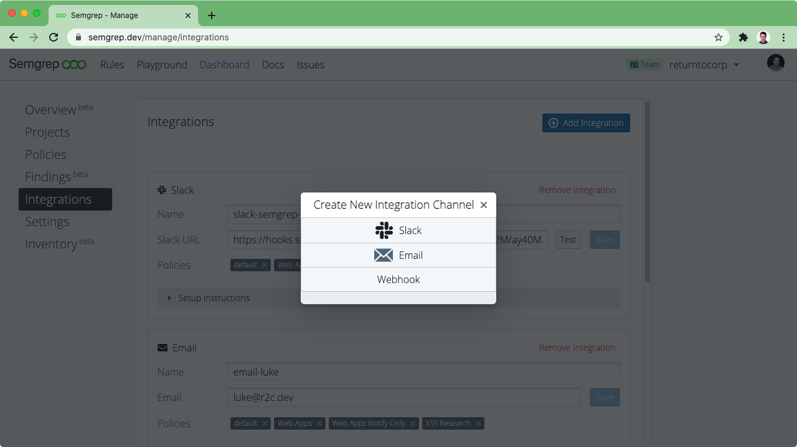

# Notifications

Semgrep CI integrates with 3rd party services when connected to Semgrep App.
When integrations are configured, you can receive notifications about Semgrep CI findings and failures.

[TOC]

# De-duplication

Notifications are sent only the first time a given finding is seen.

Because of Semgrep CI's diff-awareness, you will not be notified
when a pull request has a finding that existed on the base branch already,
even if that line is moved or re-indented.

Semgrep App also keeps track of notifications that have already been sent,
so consecutive scans of the same changes in the same pull request
won't send duplicate notifications.

# Notification channels

## Slack

<p style="text-align: center; font-size: 12px">
    <br/>
    A Slack notification triggered by new findings in a pull request
</p>

To receive Slack notifications about Semgrep findings on pull requests and code pushes, visit [Dashboard > Integrations](https://semgrep.dev/manage/integrations) and select 'Add integration' or 'Setup First Integration' and then choose 'Slack'. Give your channel a name, and then follow the setup instructions on the page to retrieve your Webhook URL.



Use the 'Test' button to send a test notification and ensure that your channel is configured properly.


## Email

To receive email notifications about Semgrep findings on pull requests and code pushes, visit [Dashboard > Integrations](https://semgrep.dev/manage/integrations) and select 'Add integration' or 'Setup First Integration,' and then choose 'Email'. Enter your email address, give the channel a name of your choosing, and then click 'Save'.

On each scan that has at least one finding, you will receive one email from Semgrep with a summary of all of the findings from that scan.

## GitHub pull request comments

Pull request comments are left when

1. Semgrep finds a result in CI, and
2. [the CI policy has pull request comments enabled](managing-policy.md#changing-policy-actions)

Automated comments on GitHub pull requests look like this:


Note that [Semgrep App](https://semgrep.dev/manage) uses the permissions requested by [the Semgrep GitHub App](https://github.com/marketplace/semgrep-dev) to leave PR comments.

If you are using Github Actions to run Semgrep, no extra changes are needed to get PR comments. If you are using another CI provider, in addition to the environment variables you set after following [sample CI configurations](semgrep-ci/sample-ci-configs.md) you need to ensure that the following environment variables are correctly defined:

- `SEMGREP_COMMIT` is set to the full commit hash of the code being scanned (e.g. `d8875d6a63bba2b377a57232e404d2e367dce82d`)
- `SEMGREP_PR_ID` is set to the PR number of the pull request on Github (e.g. `2900`)
- `SEMGREP_REPO_NAME` is set to the repo name (e.g. `returntocorp/semgrep`)

## GitLab merge request comments

Interested in GitLab merge request comments? [Sign up for the beta here.](https://go.r2c.dev/join-gitlab-beta)

## Webhooks

Webhook notifications are a paid feature in the Semgrep Team tier.

To receive webhook notifications about Semgrep findings on pull requests and code pushes, visit [Dashboard > Integrations](https://semgrep.dev/manage/integrations) and select 'Add integration' or 'Setup First Integration,' and then choose 'Webhook'. Enter a target URL, give the notification channel a name of your choosing, and then click 'Save'.

The URL will receive a POST request for each new finding.
If one scan returns eight findings, eight separate requests will be sent.
The body of the payload will be a JSON object that looks like this:

```json
{
  "semgrep_finding": {
    "id": "241dbe518caf15f800131d2d0c70bf08",
    "mute_date": null,
    "assigned_date": null,
    "assigned_by_user_id": null,
    "ref": "refs/pull/2658/merge",
    "start_date": "None",
    "fix_date": null,
    "end_date": null,
    "check_id": "log-exc-info",
    "path": "server/semgrep_app/handlers/registry.py",
    "line": 185,
    "column": 9,
    "message": "Error messages should be logged with `exc_info=True` in order to propagate\nstack information to Sentry. Either change the logging level or raise an Exception.\n",
    "severity": 1,
    "index": 0,
    "end_line": 187,
    "end_column": 10,
    "commit_date": "2021-06-07T15:26:35+03:00",
    "metadata": {
      "dev.semgrep.actions": [],
      "semgrep.policy": {
        "id": 8168,
        "name": "Web Apps Notify Only",
        "slug": "web-apps-notify-only"
      },
      "semgrep.ruleset": "johndoe:log-exc-info",
      "semgrep.url": "https://semgrep.dev/s/johndoe:log-exc-info"
    }
  }
}
```
