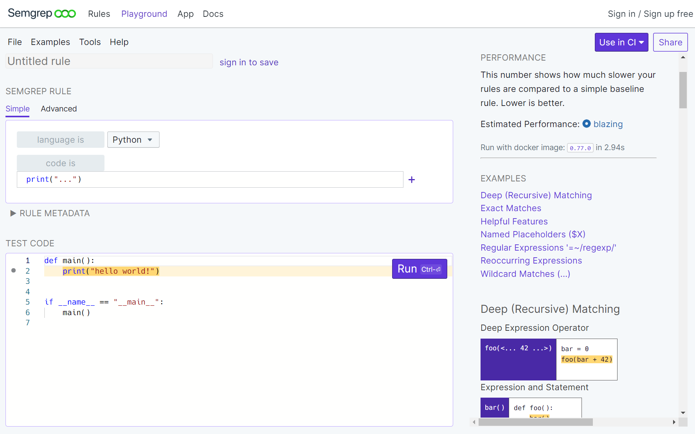
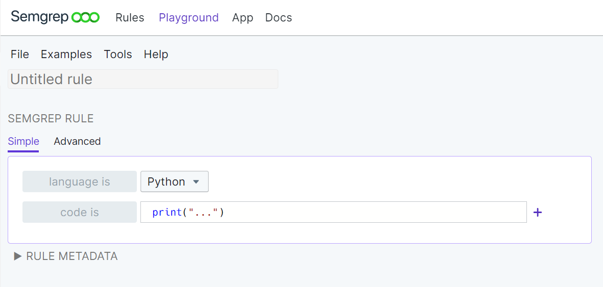
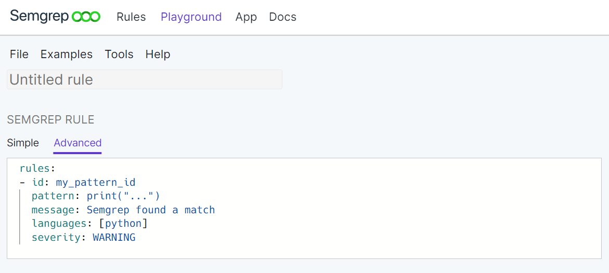
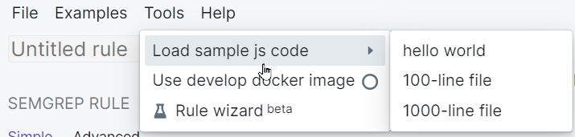
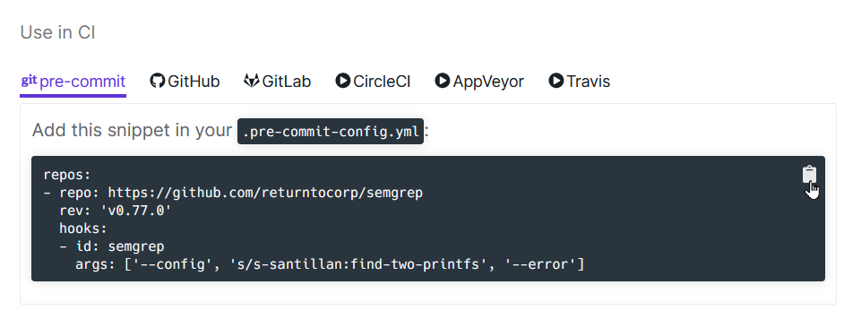
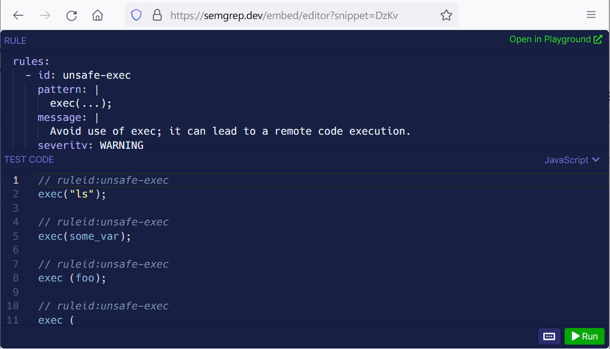

import MoreHelp from "/src/components/MoreHelp"

# Creating rules with Semgrep Playground

Semgrep Playground is a live editor used to create and test rule patterns on sample code. By testing the pattern out on sample code, you are able to quickly assess the purpose, utility, and speed of a rule as well as save it for later refinement, reuse, or sharing.

## Creating a rule

There are two ways to create a rule:

<dl>
    <dt>Simple view</dt>
    <dd>The simple view is best for quick and simple pattern-matching use cases, but does not display all Semgrep operators.</dd>
    <dt>Advanced view</dt>
    <dd>The advanced view provides the required YAML keys for a Semgrep rule. To complete the rule, the advanced view requires users to fill in additional keys such as pattern operators or metadata.</dd>
</dl>

### Learning Semgrep basics through the simple view 

The simple view provides the **most common pattern-matching operators in Semgrep**. This view is used by default.



The following **keys** are **supported** in the simple view:

* `language`
* `pattern`
* `pattern-either`
* `pattern-inside`
* `pattern-not`
* `pattern-not-inside`
* `pattern-regex`
* `message`
* `autofix`

These keys appear as drop-down boxes.

The following **metadata keys** are **supported** in the simple view:

* `category`
* `technology`
* `source-rule-url`

To view these metadata keys, Click **Rule Metadata**.

#### Limitations of the simple view

The simple view has the following limitations:

* Supports only **one language** per rule.
* Does **not** include support for the following operators:
    * `pattern-not-regex`
    * `metavariable-regex`
    * `metavariable-pattern`
    * `metavariable-comparison`

* Does **not** support the following modes:
    * Join mode
    * Taint mode

To **create a rule** in the simple view:

1. Ensure that you are in the **Simple view**:

2. Click **File > New** to start from a blank slate.
3. Specify in which language the test code is written by selecting a language from the **language is** drop-down box.
4. After the **code is** button, enter the pattern to test.
5. Optional: Click on the **plus** button to add fields for additional operators. Select the pattern operator and enter the pattern.
6. Optional: Click on **Rule metadata** to enter additional metadata fields.

### Writing complex rules using the advanced view

The advanced view is a YAML editor for writing a rule **using any valid key from the Semgrep [schema](../writing-rules/rule-syntax/)**. Advanced view provides default values for the required keys for a Semgrep rule definition and expects the user to modify and add keys to finish the rule.

To create a rule in the advanced view:

1. Ensure that you are in the **Advanced view**.

2. Enter the keys and values needed to finish your rule.

## Running and testing a rule for precision

To **run a rule**:

1. Enter your own code snippet or use samples from the Playground.
2. Optional: Use the `develop` branch docker image by clicking **Tools > Use develop docker image**. This docker image contains the latest code pushed to Semgrep's repository, including experimental features.
3. Click **Run** or press **Ctrl+Enter** (**⌘++Enter** on Macs).

To **use a sample** from the Playground:

1. Click **Tools > Load sample `LANGUAGE` code**.

2. Select any of the following:
    1. hello world
    2. 100-line file
    3. 1000-line file
3. The rule is executed automatically on the selected option.
4. To run again, click Run or press **Ctrl+Enter** (**⌘++Enter** on Macs).

100-line and 1000-line files are from random from GitHub open source projects.

**Testing a rule** ensures that it meets your standards for precision and speed. Aside from running a rule in the Playground, it is possible to test a rule by creating comment annotations for intended and unintended matches. You can achieve this by creating a test file.

Refer to [Testing rules](../writing-rules/testing-rules) for the syntax and method to run test files.

### Debugging errors when creating a rule

Common errors are syntax or match issues.

#### The pattern can't be parsed for the language

Check that the **Language is** value and **Test code** language match. Use full AST elements for the language. For example:

* In Java, Python's ``print`` command is not a valid element.
* ``1+`` or ``if $X:`` are not valid patterns because they are not full AST elements.

#### The pattern syntax is invalid

Check your metavariable definitions, and use of operators. Metavariables must be uppercase letters preceded by a dollar sign $, such as `$PAYMENT_OUTPUT` or `$X`. Refer to [Pattern syntax](../writing-rules/pattern-syntax/).

#### The YAML syntax is unparsable in the advanced view

Check for spelling and indentation issues. The key names must match [Semgrep's schema](../writing-rules/rule-syntax/).

#### The rule does not behave as expected or does not find the desired match

File a [bug](https://github.com/returntocorp/semgrep/issues/new?title=semgrep.dev%20bug%20report) or reach out through [Semgrep Community Slack](https://r2c.dev/slack).

### Evaluating a rule's performance

After running Semgrep on the test code, a summary of findings appears under the **Matches** column.

The **Performance **column displays how long it takes in seconds for Semgrep to run your rule. It also displays the following benchmarks:

* Blazing
* Quick
* Decent
* Fair
* Okay
* Slow
* Sluggish

These benchmarks take into account the **visual complexity** of the rule.

## Setting code standards by adding a rule to the Rule Board

The [Rule Board](../semgrep-app/rule-board/) displays rules that Semgrep App uses to scan your project's code. Adding a rule to the Rule Board allows you to quickly set a rule as part of every Semgrep scan. A rule on the Rule Board is represented as a card and can be placed on either the Audit Board or the Block board depending on the importance of the rule. Rules can be dragged from one column to another.

To add a rule to the Rule Board:

1. Ensure that you are logged-in.
2. Click **Add to Rule Board**.
3. Select either the Audit or Block boards depending on the importance of the rule. Matches for rules on the Block board will prevent PR merges within a CI environment.

## Saving and sharing a Semgrep rule

A rule is saved by either **explicitly naming it** or when it is **assigned a shortcode** for sharing. Rules are **unlisted** by default. This means they do not appear publicly in the Registry nor can they be searched for, but are accessible through their sharing URL.

To explicitly name a rule:

1. Sign into Semgrep.
2. Click the **Untitled rule** box.
3. Enter the name of your rule and click **Save**.

To assign a random shortcode:

1. Click **Share**. This auto-generates a random shortcode and URL to access the rule.

To retrieve or open a rule:

1. Click **File > Open**
2. Enter the rule's name in the **Filter** search box or scroll to find the rule.
3. Click on the rule. The rule loads into the Playground.

To rename a rule:

1. Sign into Semgrep.
2. In the Playground, open the rule to rename.
3. Enter a new name and press **Save**. This creates a new rule.
4. Delete the old rule to complete the renaming process.

## Using a rule in CI

Using a rule in your CI pipeline enables you to **run the rule at a certain hook or event**. This allows users to add guardrails against security, style, and general code violations.

Semgrep can be used in the following CI environments:

* GitHub (pre-commit and workflows)
* GitLab
* CircleCI
* AppVeyor
* TravisCI

### Prerequisite

The prerequisite for using a rule in CI is as follows:


1. Ensure that you have sufficient permissions to update your CI environment.

To add your rule to your CI pipeline:

1. Click **Share**.
2. Select the CI environment from the tabs under the header **Use in CI**.
3. Click on the **clipboard icon** on the upper right of the snippet to copy it.
4. Paste the snippet into the **config file** specified above the snippet.


## Embedding a rule in your site

The **Embedded Playground** is an interactive editor which can be embedded in an external domain or web page such as a blog post. It is a means to display Semgrep's rules in action.

The Embedded Playground has two panes:

<dl>
    <dt>Rule Pane</dt>
    <dd>This displays the rule data. The rule must have a <strong>reference</strong> (either a short identifier or saved name) from Semgrep Playground.</dd>
    <dt>Test Code</dt>
    <dd>This displays the code that the rule will act upon. On the bottom right is the Run button, which will run the rule on the test code.</dd>
</dl>

Both panes are editable, allowing viewers to try the Semgrep rule out for themselves or to change parts of the rule.

### Prerequisites


The prerequisite for embedding a rule in your site is the following:

- A site or page with sufficient editing permissions for you to embed the rule.

To embed a rule:

1. In the Playground, click **Share**.
2. Copy the **identifier**. This comes in two patterns:
    1. For signed-in users: `[username]:[rule-name]`, such as `ievans:print-to-logger`
    2. For anonymous users: `[4-letter shortcode]`, such as **dZkP**
3. Create the **URL reference**. Substitute the identifier in this template: `https://semgrep.dev/embed/editor?snippet=IDENTIFIER`. For example, using the identifier `ievans:print-to-logger` creates `https://semgrep.dev/embed/editor?snippet=ievans:print-to-logger`.
4. Optional: To test the URL reference, enter the URL in your browser's address bar.

5. In the following snippet, replace the `src` placeholder value with the previously-created **URL reference**:

```
 <iframe title="Semgrep example no prints" src="URL_REFERENCE" width="100%" height="432" frameborder="0"></iframe>
```
Our example's finished result is:

```
<iframe title="Semgrep example no prints" src="https://semgrep.dev/embed/editor?snippet=ievans:print-to-logger" width="100%" height="432" frameborder="0"></iframe>
```

<MoreHelp />
