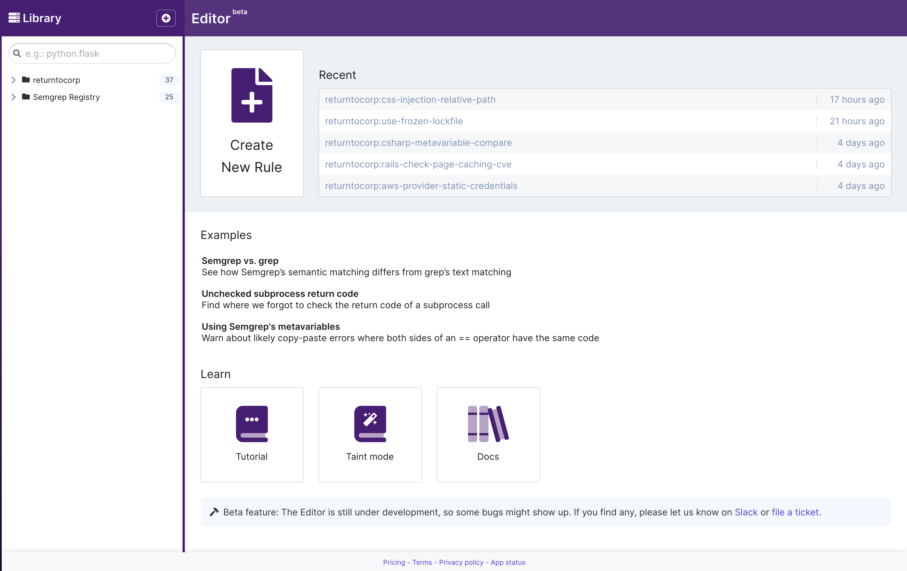

import MoreHelp from "/src/components/MoreHelp"

# Writing rules using Semgrep Editor

**Semgrep Editor (Beta)** is an advanced tool for **rule writing**. Write rules on a YAML editor, verify their performance through tests, and add them to your organization’s [Rule Board](https://semgrep.dev/docs/semgrep-app/rule-board/) to enforce code standards and increase code security.

To quickly learn Semgrep patterns and syntax, explore the Editor’s library of rules from the **public [Rule Registry](https://semgrep.dev/r)**. Rules from the Registry can detect OWASP vulnerabilities, best practice violations, and security issues for a wide variety of languages and frameworks. Semgrep Editor enables you to **adapt these rules** for your own organization’s use by [forking](#jumpstart-rule-writing-using-existing-rules) them.

The Editor is free to use on all tiers, but saving a rule for **private use** is a **Team/Enterprise tier feature**.

## Accessing Semgrep Editor

1. Sign in to your [Semgrep App account](https://semgrep.dev/login).
2. Click **Editor (beta)** from the **App sidebar**. The **splash page** and **library pane** appear.
3. Do any of the following steps:
    1. To create a new rule, click on the **(+) plus sign** or **Create new rule** button.
    2. To open any rule you’ve recently edited, select it from the **Recent** list.
    3. To view a sample rule, select it from the **Examples** list. The rule renders within the Editor.
    4. To start a tutorial or read the docs, select it from the **Learn** list. This navigates you away from the Editor.

## Viewing rules

The editor is composed of three panes and a top menu.

<dl>
    <dt>Library</dt>
    <dd>View and open various rules through the library. It contains two top-level folders:
        <ul>
            <li>Your organization’s rules</li>
            <li>Publicly-available Semgrep Registry rules from the <code>semgrep-rules</code> repository</li>
        </ul>
        <strong>Private rules</strong> are denoted by a <strong>lock</strong> icon overlaid over the file icon.
    </dd>
    <dt>Rule editor</dt>
    <dd>Enter your rule’s YAML schema in this pane.</dd>
    <dt>Sample code window</dt>
    <dd>Enter your rule’s test code in this pane and click the <strong>Run button</strong> to verify that the rule runs as intended. A <strong>matches panel</strong> appears after Semgrep is run to display matches and tests.</dd>
    <dt>Top menu</dt>
    <dd>Save, share, and add your rule to the Rule Board through this menu.</dd>
</dl>

To **resize the panes**, position your mouse over the borders and click-drag to the desired width. The library pane can be completely hidden to give more space for the editing panes.

Semgrep Registry rules are initially grouped by **directory**. Most of these directories correspond to languages. The Library can also be grouped by **rulesets**, which are rules arranged by category, such as security, best practices, and frameworks.

To group by ruleset, right click on the empty space on the **official registry** entry and select **Group by ruleset**.

## Creating a rule

To create a rule, click **Create rule** on the splash page or the **(+) sign** next to the Library label. The Editor provides the minimum fields to create a rule:

- `id`
- `pattern`
- `message`
- `languages`
- `severity`

Refer to [Rule syntax](https://semgrep.dev/docs/writing-rules/rule-syntax/) for all possible fields and values to create a rule.

### Jumpstart rule writing using existing rules

Another method of creating rules is by **forking/copying** from existing rules found in Semgrep Registry. For example, Semgrep’s Java `crypto` ruleset prohibits the use of weak hashing algorithms `SHA-1` and `MD5`. An organization may want to further limit the use of other hash functions as part of their standards or security compliance. The next steps illustrate forking through copying an existing `use-of-sha1` rule and changing the rule to forbid MD2 hashes.

1. Enter related terms into the search bar to find potential rules. In our example, this is `SHA1.` 

2. Registry rules cannot be edited directly. They can be **forked** by **right-clicking on their entry** in the Library and selecting **Fork rule.** 

 

3. The rule is copied to your organization’s rules.
4. Enter edits to finalize your rule. In this example, the patterns are changed to find matches for [MD2](https://docs.oracle.com/javase/9/docs/specs/security/standard-names.html#messagedigest-algorithms) and the severity is increased from `WARNING` to `ERROR`.
5. Enter updates to test cases.
6. Click **Run** to validate your rule.
7. Click **Save** to save your rule. The following rule displays the end result.

<iframe title="Prevent use of MD2" src="https://semgrep.dev/embed/editor?snippet=s-santillan:use-of-md2" width="100%" height="432px" frameBorder="0"></iframe>

### Debugging syntax issues

The editor will not save, share, or run if the YAML syntax is **unparseable**. The editor supports error handling, for the following cases:

- Invalid language keys
- Incorrect severity fields
- Missing `id` key
- Missing required schema fields

If no schema or spelling errors are detected, check for indentation or newline issues. You can also get rule-writing help through the [community Slack](https://r2c.dev/slack).

## Evaluating a rule’s performance

Evaluating a rule through testing ensures that it meets your standards for precision and speed, thus **reducing false positives**. Semgrep uses certain annotations in comments to enable users to test which blocks of code are intended to match with a rule, and which blocks of code should not match.

In the following example, run the rule and click on the three-dot menu to view the result of the tests.

<iframe title="Testing example" src="https://semgrep.dev/embed/editor?snippet=7n1W" width="100%" height="432px" frameBorder="0"></iframe>

To **test a rule**:

1. Create at least one **true positive**: a code sample intended to match the rule.
2. Above this potential match, create a comment, followed by a space (` `), followed by `ruleid:RULE_ID` which specifies the rule that should match. In the preceding example, this is `// ruleid:hardcoded-conditional`.
3. Create at least one **true negative**: a code sample intended not to match the rule.
4. Above this non-match, create a comment followed by a space ( ), followed by `ok:RULE_ID`. For example, `// ok:hardcoded-conditional`.
5. Optional: add more code samples with their corresponding annotations.
6. Click **Run**. Semgrep will detect the annotations and validate the rule based on your tests.

For additional annotations designed to test false positives and false negatives, refer to [Testing rules](https://semgrep.dev/docs/writing-rules/testing-rules/).

## Renaming and saving a rule

- To rename a rule, enter the new name in the YAML editor’s `id` field.
- To save a rule, enter **Ctrl+S** or click the **Save** button.

## Sharing a rule and setting a rule’s visibility

Upon saving, a rule’s visibility is **unlisted** by default. This rule can be shared with anyone through an identifier, even to non-Semgrep App users.

A rule can be saved as a **private rule**, which is visible only to members within an organization. You can still share a private rule, but only members of the organization will see it. Private rules are a **Team/Enterprise tier feature**.

- To set a rule’s visibility to private, click **Share > Private > Save change**.
- To share a private or unlisted rule, click **Share** and copy the **URL link**.

## Deleting a rule

To delete a rule, right click on its entry in the Library pane and select **Delete rule**. Deleting a rule is permanent. If the rule was previously added to the Rule Board, it is removed upon deletion.

## Setting code standards with the Rule Board

Adding a rule to the Rule Board applies the rule across all projects scanned by Semgrep App. The rule can be added to either the **Audit** or **Blocker** columns. Rules in the Blocker column will prevent PRs from being merged until the finding is resolved.

To add a rule to the Rule Board:

1. Click **Add to Rule Board**.
2. Select which column (Audit or Blocker) to add the rule to, depending on the rule’s relevance.
3. The rule appears on your Rule Board, under the corresponding column.

## Contributing to the open-source Semgrep Registry

r2c, the maintainers of Semgrep, welcome contributions to the Registry. This is achieved by creating a pull request (PR) either on the repository itself or through the Editor. Contributions to the Registry can be discovered by anyone through the [Registry](https://semgrep.dev/explore) and Editor.

Guidelines for faster rule acceptance:

- Include **test cases** for both a true positive and a true negative.
- Include a descriptive rule **message**.
- Fill out **metadata fields** for the following:

<table>
  <tr>
    <th>Metadata field</th>
    <th>Sample values</th>
  </tr>
  <tr>
    <td><code>category</code></td>
    <td>
        <ul>
            <li><code>best-practice</code></li>
            <li><code>correctness</code></li>
            <li><code>maintainability</code></li>
            <li><code>performance</code></li>
            <li><code>portability</code></li>
            <li><code>security</code></li>
        </ul>
    </td>
  </tr>
  <tr>
    <td><code>technology</code></td>
    <td>
        <ul>
            <li><code>django</code></li>
            <li><code>docker</code></li>
            <li><code>flask</code></li>
            <li><code>kubernetes</code></li>
            <li><code>nginx</code></li>
            <li><code>react</code></li>
            <li><code>terraform</code></li>
            <li><code>TARGET_LANGUAGE</code></li>
        </ul>
    </td>
  </tr>
</table>

To **create a PR** from the Editor:

1. Click **Share > Public.**
2. Optional: Enter the path to the rule following the namespace `language.group.subgroup.rule_name`. A repository maintainer can also set this for the rule.
3. Optional: Preview the rule.
4. Click **Create PR**.

<MoreHelp />
