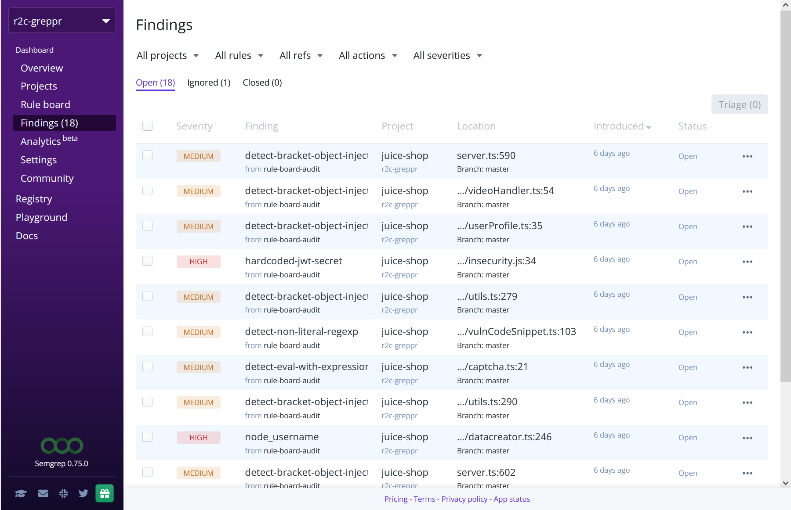
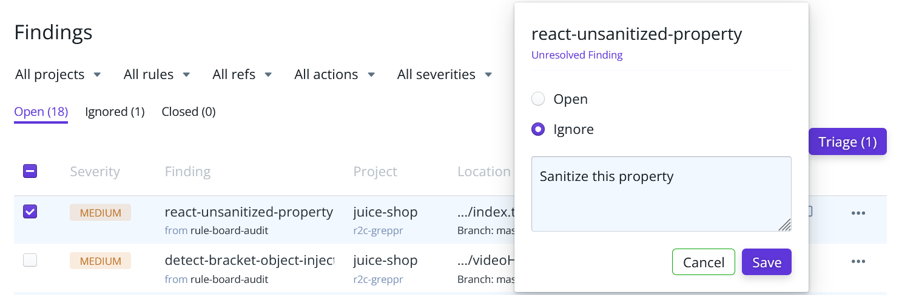

import MoreHelp from "/src/components/MoreHelp"

# Managing findings in Semgrep App

 

A **finding** is the core result of Semgrep's analysis. Findings are generated when a Semgrep rule matches a piece of code.

Types of findings:

* anti-patterns
* security vulnerabilities, business, or logic bugs
* audits for dangerous function use
* reviewing authentication or authorization logic
* custom pattern matches based on your own custom rules

Findings include a `message` that describes the security issue or bug that must be resolved. Findings may also provide an `autofix` that fixes the issue by creating a suggestion within your source code management (SCM) tool, such as GitHub or GitLab.

## Working with findings 
After a finding is generated, developers may:

* View the Semgrep rule and the matching code.
* Fix the issue detected by the finding.
* Ignore the finding.
* Comment on the finding.
* Create a Jira ticket from the finding (for Enterprise/Team Tier users.)

In some cases, findings can be **false positives**. 

The Semgrep App Finding page displays findings across all projects connected to Semgrep App. It is updated after every scan. Scans are initiated through your CI/CD pipeline, such as GitHub actions. The retention period of these findings varies based on your organization’s tier:

| Retention period | Tier availability |
| ---------------  | ----------------- |
| 30-day findings retention | Community (Free) |
| 1-year findings retention | Team/Enterprise |

## Viewing data in the Findings page

### Navigating to the Findings page

1. Sign in to Semgrep App.
2. The **Findings** page can be found on the left sidebar.

### Understanding the Findings data

The Findings page displays the following fields:

| Field       | Description |
| ----------  | ------------ |
| **Severity**    | The impact of a finding. Possible values: Low, Medium, High, and Critical. |
| **Finding**     | The file, line, and branch of the pattern match in the code. Clicking on this field brings you to the exact location in the codebase. |
| **Project**     | The name of the project codebase where the finding was found. Clicking on this field brings you to the project’s URL. |
| **Rule**        | The name of the rule matched with the code. Clicking on this field brings you to the rule’s entry in the [rule registry](https://semgrep.dev/r). |
| **Introduced**  | The time when this finding was first found. Clicking on the header row sorts the table by latest or earliest findings. |
| **Status**      | Refers to a finding’s state. |

## Triaging findings

Triaging means prioritizing a finding based on a policy or criteria set by your team or organization. While severity is a factor in triage, your organization may define additional criteria based on coding standards, business, or product goals.

Semgrep App assists in the triage process through the use of **comments** and **triage states**:

| Triage state | Description |
| -----------  | ------------ |
| **Open** | Open findings require action, such as rewriting the code for vulnerabilities, or refactoring the code. Findings are open by default. |
| **Ignored** | Findings that are ignored will not be acted upon. This may be a false positive or deprioritized issue. Findings can be ignored through Semgrep App (see [Managing triage states](#managing-triage-states-bulk-triage)). |
| **Fixed** | Fixed findings are findings that were detected in a previous scan but no longer trigger a match in the most recent scan. The rule that detected the finding and the code that triggered the match must both be active in the most recent scan. |

### Filtering findings

Filtering allows you to easily isolate groups of findings for ease in triaging and identifying related groups of issues. The following criteria are available for filtering:

| Filter criteria | Description |
| -----------  | ------------ |
| **Project** | Filter by projects connected to Semgrep App. |
| **Rules** | Filter by rules or rulesets that are included in your Rule Board or Policies page. More than one rule can be selected for filtering. |
| **Refs** | Filter by branches in your codebase. More than one branch can be selected for filtering. |
| **Actions** | Filter by blocking or non-blocking rules in your Rule Board or Policies page. Only one action can be selected for filtering. |
| **Severities** | Filter by the severity of a finding. More than one severity can be selected. |

To filter through all findings:

1. Click on the filter criteria’s drop-down box.
2. Select the value by which the findings are filtered.
3. The page then refreshes to reflect the additional criteria.
4. Additional values may be selected to further refine your filter.

### Sorting findings

* Findings may be sorted by their respective fields (see **Fields** table above).
* To sort a finding, click on the desired **row header**.

### Managing triage states (bulk triage)

Bulk triage can be performed by filtering through the findings, and then you can select which findings to be:

* Opened
* Ignored

 

To **ignore findings**:

1. Click **Open** to see all open findings.
2. After the findings are filtered, perform one of these steps:
    - Select all of the results by clicking on the header row checkbox. You can navigate to succeeding pages and add to the current selection.
    - Select relevant findings one-by-one by clicking on their checkboxes individually.
3. Click the **Triage** button.
4. Click **Ignore**.
5. Optional: Include a **comment** explaining the action.

To **open findings**:

1. Click **Ignored** to see all ignored findings.
2. After the findings are filtered, perform one of these steps:
    - Select all of the results by clicking on the header row checkbox. You can navigate to succeeding pages and add to the current selection.
    - Select relevant findings one-by-one by clicking on their checkboxes individually.
3. Click the **Triage** button.
4. Click **Open**.
5. Optional: Include a **comment** explaining the action.

To **fix a finding**, update, or refactor the code such that the Semgrep rule pattern no longer matches the code.

* Remove the rule from the Rule Board.

To **remove a rule** from the Rule Board:

1. Click **Rule Board**.
2. Click on the ruleset that contains the rule.
3. Drag the rule tile to the **Discard rule** section.

To **view comments**:

* Click the **speech balloon** next to the finding’s status.

## Creating Jira tickets from findings

Semgrep supports the creation of Jira tickets from a finding. This enables developers and project managers to relevant issues within their own project or bug tracking environment. This feature is available to Team/Enterprise Tier users.

To **create a ticket**:

1. Set up a Jira integration through the [Integrations](https://semgrep.dev/docs/semgrep-app/integrations/) guide.
2. Click on the **three-dot icon** of the entry.
3. Click **Create issue with Jira**.

## See also

* [Integrations](integrations.md)
* [Rule Board](rule-board.md)
* [Ignoring files, folders, or code](../ignoring-files-folders-code.md)

## Additional references

* [Writing Semgrep rules: a methodology](https://r2c.dev/blog/2020/writing-semgrep-rules-a-methodology/)

<MoreHelp />
