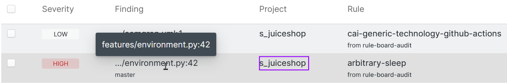

import MoreHelp from "/src/components/MoreHelp"

Semgrep App supports code scanning from:

* local command-line interfaces (CLI)
* source code management (SCM) systems, such as GitHub and GitLab, through continuous integration (CI)

This guide walks you through scanning code in both types of environments.


Semgrep App enables you to run scans on multiple repositories by integrating with your GitHub or GitLab SaaS account. Semgrep uses **rules** to scan code. Matches found based on those rules are called **findings**. A Semgrep rule encapsulates pattern-matching logic and data-flow analysis used to find code violations, security issues, outdated libraries, and other issues.


Many rules are available from [Semgrep Registry](https://semgrep.dev/r), an open-source, community-driven repository of rules. You can also write your own rules to customize Semgrep for your team's specific practices, or publish rules for the community.

With Semgrep App's Rule Board you can determine which rules Semgrep uses and what action Semgrep undertakes when it generates a finding. The Rule Board can block pull requests (PRs) or merge requests (MRs) from merging until findings are resolved. This behavior helps to prevent vulnerable code from shipping to widely-accessible environments, such as production or staging servers.

Semgrep App enables you to deploy, configure, and manage Semgrep in your continuous integration (CI) environment. Semgrep App supports the upload of findings from CLI scans as well. For more information, see [Getting started with Semgrep CLI](https://semgrep.dev/docs/getting-started/).

## Signing in to Semgrep App

Signing in to Semgrep App requires either a GitHub or GitLab account. Semgrep App supports Single Sign-On (SSO) on Team or Enterprise tiers. This guide focuses on GitHub and GitLab sign-ins. See [SSO Configuration](https://semgrep.dev/docs/semgrep-app/sso/) for information on single sign-on.

**Prerequisite:** A GitHub or GitLab SaaS account. The account is used to confirm your identity.

### Signing in with GitHub

To sign in to Semgrep with a GitHub account:

1. Click the following link: [Sign into Semgrep](https://semgrep.dev/login?return_path=/manage/projects).
2. Select **Sign in with GitHub**. You are redirected to the GitHub sign in page if you are not currently signed in.
3. Sign in with your credentials.
4. Click **Authorize semgrep-app**. See the GitHub documentation about [Authorizing GitHub Apps](https://docs.github.com/en/authentication/keeping-your-account-and-data-secure/authorizing-github-apps) to understand the scope of permissions requested by Semgrep.
5. You are redirected back to Semgrep App.
6. Click **Accept** to accept Semgrep's Terms of Service.
7. Optional: Fill out the survey and click Complete or click Skip to omit this step.

You are now signed in to Semgrep App.

#### Permissions for GitHub

This section explains why Semgrep App requires specific permissions. Semgrep App requires the following permissions in order to log in through GitHub:

<dl>
    <dt>Verify your GitHub identity</dt>
    <dd>Enables Semgrep App to read your GitHub profile data, such as your username.</dd>
    <dt>Know which resources you can access</dt>
    <dd>Enables Semgrep App to access and display private repositories you can scan.</dd>
    <dt>Act on your behalf</dt>
    <dd>Enables Semgrep App to start or stop scans on the repository and commit files for continuous integration.</dd>
</dl>

The GitHub integration app is called `semgrep-app`. This app is used to integrate Semgrep into GitHub repositories. It requires the following permissions:

<dl>
    <dt>Read and write permissions to <a href="https://docs.github.com/en/actions">GitHub Actions</a></dt>
    <dd>Allows Semgrep App to cancel stuck jobs, rerun jobs, pull logs from jobs, and perform on-demand scanning.</dd>
    <dt>Read permissions to <a href="https://docs.github.com/en/rest/reference/checks">GitHub Checks</a></dt>
    <dd>Facilitates debugging of Semgrep App when configured out of GitHub Actions.</dd>
    <dt>Read and write to GitHub Security Events</dt>
    <dd>Enables integration with the GitHub Advanced Security to show Semgrep results.</dd>
    <dt><code>.semgrepignore</code> single-file access</dt>
    <dd>Allows debugging of requests and automatic syncing of <code>.semgrepignore</code> between the Semgrep App UI and what is checked into the repository.</dd>
    <dt>Read/write GitHub secrets</dt>
    <dd>Enables automatically adding of the Semgrep App Token to your repository secrets when onboarding projects. This simplifies bulk onboarding of repositories. <strong>Semgrep App cannot read the values of your existing or future secrets due to the security design of GitHub Secrets.</strong> This permission only permits Semgrep App to know the secret name and programmatically adds the Semgrep token to your repository secrets.</dd>
</dl>

### Signing in with GitLab

1. Click the following link: [Sign into Semgrep](https://semgrep.dev/login?return_path=/manage/projects).
2. Select **Sign in with GitLab**. You are redirected to the GitLab sign in page if you are not currently signed in.
3. Sign in with your credentials.
4. Click **Authorize**. See the GitLab documentation about [Authorized applications](https://docs.gitlab.com/ee/integration/oauth_provider.html#authorized-applications) to understand the scope of permissions requested by Semgrep.
5. You are redirected back to Semgrep App.
6. Click **Accept** to accept Semgrep's Terms of Service.
7. Optional: Fill out the survey and click Complete or click Skip to omit this step.

You are now signed in to Semgrep App.


#### Permissions for GitLab

Semgrep requires the following permissions (scopes) to enable the authentication of a session:

* `openid`
* `email`
* `profile`

## Performing a scan

Scanning is Semgrep's primary operation. When you first sign into Semgrep App, it uses a default ruleset selected to enforce best practices for a repository's framework and programming language. Future scans may be further tuned to an organization's specific practices.

Semgrep App enables users to choose what findings prevent a pull or merge request (PR or MR) from merging into the repository. Setting these blocking and non-blocking rules is achieved through the Rule Board.

### Scanning a new project 

A **project** is a repository from either:

* Your GitHub or GitLab account that you add to Semgrep App for scanning. Projects from GitHub or GitLab are integrated through Semgrep App.
* A local Git repository in your machine. Projects from your local machine are integrated through Semgrep CLI.

Semgrep App can run scans on many projects with rules set in the Rule Board. First-time Semgrep App users scan projects with pre-selected rules chosen based on the repository's language and framework. To view these pre-selected rules, see the [Registry default ruleset](https://semgrep.dev/p/default).

Over time, users modify the Rule Board with rules specific to their codebase's security or business goals.  

#### Option A: Scanning a local repository through Semgrep CLI

Scanning a project from the CLI is a standalone action. This means that you manually triggered the scan. Scans from CLI are not continuous nor scheduled, unlike scans run in a CI job.

**Prequisite:** Semgrep CLI must be installed. See [Getting started with Semgrep CLI](../../getting-started).

1. Ensure you are signed in to Semgrep App.
2. Click **Projects** on the left sidebar.
3. Click **Scan new project** > **Run a scan locally**.
4. Log in to Semgrep from the CLI:
    ``` 
    semgrep login
    ```
6. Follow the instructions on the CLI.
5. After logging in, run a scan by entering the following command. This command sends the findings to Semgrep App.
    ```
    semgrep ci
    ```
6. View your project's [findings](https://semgrep.dev/orgs/-/findings).

:::note
Scans from local repositories do not access their corresponding remote repositories. For this reason, links to specific lines of code in the Findings page are not created. See [Linking local scans to their remote repositories](#linking-local-scans-to-their-remote-repositories) for a workaround.
:::

##### Linking local scans to their remote repositories 


*Figure 1.* Partial screenshot of findings page with no hyperlinks.

Local repository scans require additional configuration to **create hyperlinks to their corresponding remote repositories**. Set up environment variables within your command line to configure cross-linking between local and remote repositories within Semgrep App.


*Figure 2.* Sample environment variables set up on a Linux shell.

To set up environment variables:

1. Ensure that your current working directory is the root of the repository to create links for. 
2. Set up the `SEMGREP_REPO_URL`:
    1. Retrieve the URL by navigating to your online repository. Copy the value in the address bar. This is your `URL_ADDRESS`.
    2. Set the variable by entering the text below, substituting `URL_ADDRESS` with the value from the previous step.
    <pre><code>
    export SEMGREP_REPO_URL=<em>URL_ADDRESS</em>
    </code></pre>
3. Set up the `SEMGREP_BRANCH`:
    1. Run the following to retrieve the branch name:
        ```bash
        git rev-parse --abbrev-ref HEAD
        ```
    2. Set the variable by entering the text below, substituting `BRANCH_NAME` with the value from the previous step.
    <pre><code>
    export SEMGREP_BRANCH=<em>BRANCH_NAME</em>
    </code></pre>
4. Set up the `SEMGREP_REPO_NAME`:
    1. Retrieve the repository name by logging in to your GitHub or GitLab account and copying the repository name from your dashboard. 
    2. Set the variable by entering the text below, substituting `REPO_NAME` with the value from the previous step.
    <pre><code>
    export SEMGREP_REPO_NAME=<em>REPO_NAME</em>
    </code></pre>
5. Set up the `SEMGREP_COMMIT`:
    1. Run the following to retrieve the commit hash:
        ```bash
        git log -n 1
        ```
    2. Set the variable by entering the text below, substituting `COMMIT_HASH` with the value from the previous step.
    <pre><code>
    export SEMGREP_COMMIT=<em>COMMIT_HASH</em>
    </code></pre>

Sample values:

```
# Set the repository URL
$> export SEMGREP_REPO_URL=https://github.com/corporation/s_juiceshop

# Set the repository name
$> export SEMGREP_REPO_NAME=corporation/s_juiceshop

# Retrieve the branch 
$> git rev-parse --abbrev-ref HEAD
s_update
# Set the branch
$> export SEMGREP_BRANCH=s_update

# Retrieve the commit hash
$> git log -n 1
commit fa4e36b9369e5b039bh2220b5h9R61a38b077f29 (HEAD -> s_juiceshop, origin/master, origin/HEAD, master)
# Set the commit hash
$> export SEMGREP_COMMIT=fa4e36b9369e5b039bh2220b5h9R61a38b077f29
 ```


*Figure 3.* Partial screenshot of findings page with hyperlinks.

#### Option B: Scanning a repository from GitHub or GitLab

Scanning a repository from SCM providers such as GitHub or GitLab ensures that Semgrep scans your codebase every time a PR or MR is created. To add a repository:

**Prerequisite:** A GitHub or GitLab SaaS repository associated with your account.

1. Ensure you are signed in to Semgrep App.
2. Click **Projects** on the left sidebar.
3. Optional: If you do not see the repository you want to add in the **Projects** page of Semgrep app, follow the steps in the succeeding sections to ensure that Semgrep App can detect the repository.
4. Click **Scan new project**, and then select which repository provider Semgrep to integrate with.
5. For **GitHub Actions**:
    1. Click **Add CI Job **next to the name of the project to add.
    2. Optional: If you do not see the repository you want to add, follow the succeeding guide on **detecting GitHub repositories**.
    3. Click **Commit file**. This commits a `semgrep.yml` file containing pertinent scan parameters, such as schedule, what branch to scan on, and so on.
    4. Semgrep App generates a token composed of a **Secret name** and **Secret value**. Copy and paste these into your repository's settings. Links are provided by Semgrep App.
    5. Click **The secret's there, continue**.
    6. Semgrep App creates a file for the CI job. Select toggles for desired features, such as scanning on a schedule.
6. For **GitLab CI/CD**:
    1. Create a Semgrep App token by clicking **Settings > Tokens > Create new token**, then return to the project setup by clicking on the back arrow on your browser.
    2. Add the Semgrep App token as a secret [CI/CD variable](https://docs.gitlab.com/ee/ci/variables/#custom-cicd-variables) named `SEMGREP_APP_TOKEN`.
    3. Select toggles to determine scan behavior.
    4. Copy the snippet provided to your `.gitlab-ci.yml` file and commit it.
7. For **CircleCI**:
    1. Create a Semgrep App token by clicking **Settings > Tokens > Create new token**, then return to the project setup by clicking on the back arrow on your browser.
    2. Add the Semgrep App token as a project [environment variable](https://circleci.com/docs/2.0/env-vars/) named `SEMGREP_APP_TOKEN`.
    3. Copy the snippet provided and commit the `circleci/config.yml` file.
8. For **other CI providers**:
    1. Create a Semgrep App token by clicking **Settings > Tokens > Create new token**, then return to the project setup by clicking on the back arrow on your browser.
    2. Add the Semgrep App token as a project environment variable named `SEMGREP_APP_TOKEN`.
    3. Copy the snippet provided and commit your CI provider's `config.yml` file.
9. If successful, Semgrep App scans the repository for the first time using default, pre-selected rules.

To ensure that your GitHub repository is **detected** by Semgrep App:

1. Log into GitHub.
2. Click your **profile photo > Settings > Applications**.
3. On the `semgrep-app` entry, click **Configure**.
4. Under Repository access select an option to provide access:
    1. All repositories will display all current and future public and private repositories.
    2. Only select repositories will display explicitly selected repositories.

### Running a scan

By default, scans are triggered through the following parameters, which are defined during a project's initial setup in Semgrep App:

* Either a daily or weekly schedule.
* Upon every PR or MR.
* Upon every update to the `semgrep.yml` file.

To change these scan parameters, either:

* Edit the `semgrep.yml` file manually.

* Remove the project and redo the steps described in Adding a project section.

Additional scan parameters include:

<dl>
    <dt>Rule recommendation</dt>
    <dd>Select this toggle to receive rule recommendations in the Rule Board based on the framework and language of the repository. Rule recommendations are only suggestions and will not be included in a scan unless you add the recommendations into a rule board.</dd>
    <dt>Autofix</dt>
    <dd>Select this toggle to enable autofix, which creates suggestions in addition to PR or MR comments. For example, a rule may suggest using a function such as <code>logging.debug()</code> instead of <code>print()</code>.</dd>
    <dt>Path ignores</dt>
	<dd>Paths and files specified here are not scanned by Semgrep App.</dd>
</dl>

To see additional scan parameters:

1. Click **Projects **on the left sidebar.
2. Select the name of the project to modify.
3. Make edits as necessary.


### Adding rules and rulesets to scan with

Semgrep App's Rule Board displays all rules and rulesets that are used to scan repositories. These rules are scanned based on the repository's programming language and framework as well as additional Semgrep parameters, such as ignored files.

For example, given five repositories each with different programming languages, the Rule Board only scans using rules and rulesets for that repository's language that are in the Rule Board.

Semgrep's speed is not affected by having multiple rules for different languages in the Rule Board.

You may select rules and rulesets from your own rules, your organization's rules, or rules from the Registry.


The Rule Board is composed of three columns:


<dl>
    <dt>Monitor</dt>
    <dd>Rules here show findings only on Semgrep App.</dd>
    <dt>Comment</dt>
    <dd>Rules here show findings to developers through PRs or MRs.</dd>
    <dt>Block</dt>
    <dd>Rules here show block merges and commits, in addition to showing findings in Semgrep App and PRs or MRs.</dd>
</dl>    

To add rules and rulesets to your Rule Board:

1. Click **Rule Board** on the left sidebar.
2. Click Add Rules. A right-side drawer appears.
3. Type in a search term relevant to your codebase's framework or programming language.
4. Drag a card from the search results to the appropriate column.
5. Select **Save changes**.

For more information on operations such as filtering and deleting as well as Rule board management, see [Rule board](../rule-board/).


## Viewing and managing findings


### Viewing findings of a scan


Both the Dashboard and the Findings page display the results of a scan. These pages are accessible from the left sidebar in Semgrep App. The **[Dashboard](../dashboard/)** is a report view to assist in evaluating security posture across repositories. It organizes findings into OWASP categories, enabling users to assess habits and trends within their team or organization.

The **[Findings](../findings/#managing-triage-states-bulk-triage)** page is used to triage findings. Triaging refers to prioritizing a finding based on criteria set by your team or organization. While severity is a factor in triage, your organization may define additional criteria based on coding standards, business, or product goals.

To see the rule specifics that triggered the finding, click on the rule entry.

### Automatically resolving findings


Include code suggestions that resolve findings in both GitHub and GitLab through Semgrep App's autofix feature. This improves the fix rate of findings by reducing the steps needed to resolve a finding. See the section above on Running a scan to enable autofix.

## Going further with Semgrep App

Semgrep app supports various phases of the development cycle through the following features:

* Integrations keep teams informed without having to leave their working environments, such as Slack or email.
* Forking Registry rules to easily write custom rules, enabling teams to enforce their own standards.
* Developer feedback enables teams to collaborate and improve on scan quality.

### Tracking findings and receiving notifications

Receive notifications of new findings through email and Slack after every scan. Additionally, Enterprise or Team tier users are able to set up notifications through webhooks and can track findings on Jira. See [Integrations](../integrations/) documentation for more information.

### Writing your own rules

Semgrep's pattern-matching behavior resembles a linter, but its data flow engine extends Semgrep's capabilities as a static application security testing (SAST) tool.

Semgrep provides the following environments to learn, experiment, and write Semgrep rules:

<dl>
    <dt><a href="https://semgrep.dev/learn">Tutorial</a></dt>
	<dd>Learn Semgrep's pattern matching syntax, rule composition, and advanced features.</dd>
    <dt><a href="https://semgrep.dev/playground">Playground</a></dt>
    <dd>Learn the nuances of Semgrep operators by creating your own rules and run Semgrep on your own test cases.</dd>
    <dt><a href= "https://semgrep.dev/login?return_path=/orgs/-/editor">Editor</a></dt>
    <dd>Fork existing security rules to customize them for your own organization or team's use in this advanced editor. Refer to <a href="../editor/#jumpstart-rule-writing-using-existing-rules">Writing rules using Semgrep Editor</a>.</dd>
</dl>

### Receiving feedback about a rule

[Developer feedback](../dashboard/#rule-performance-through-developer-feedback) is a Team/Enterprise tier feature in which developers can submit feedback about a rule or finding. This is used to evaluate a rule's performance:

* Is the rule's message clear?
* Does the rule have too many false positives?
* Should the rule be ignored for a certain file or block of code?
* Are there additional improvements to the rule, such as possible autofix values?

### Getting support

Refer to [Troubleshooting Semgrep App](../troubleshooting/semgrep-app/) for common installation issues. Help is also available for all users through the[ r2c Community Slack](https://r2c.dev/slack).

<MoreHelp />
