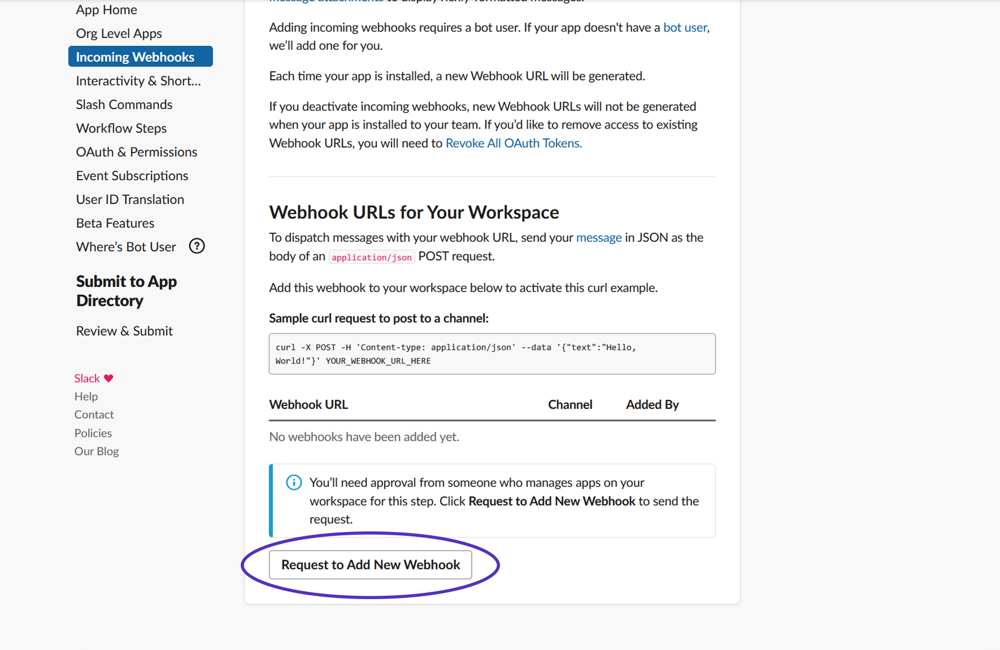
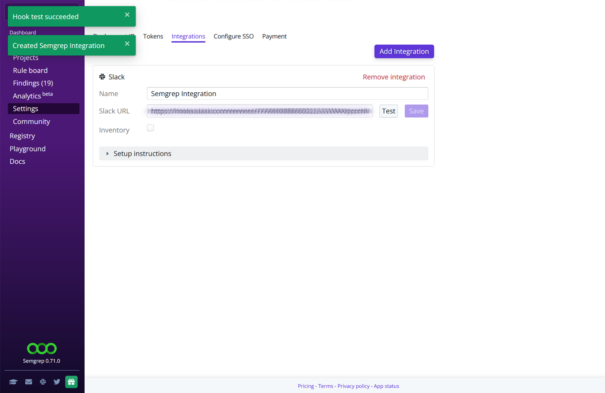
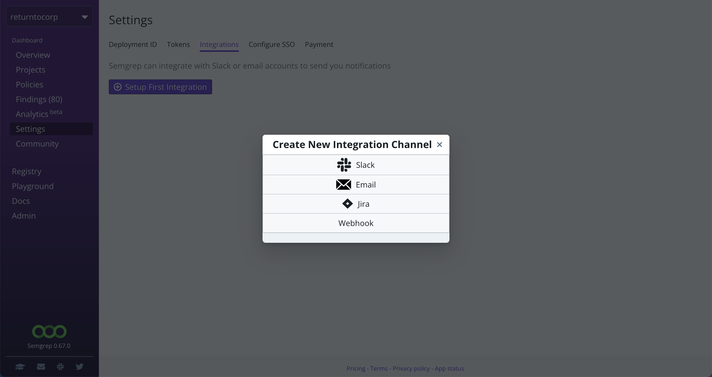
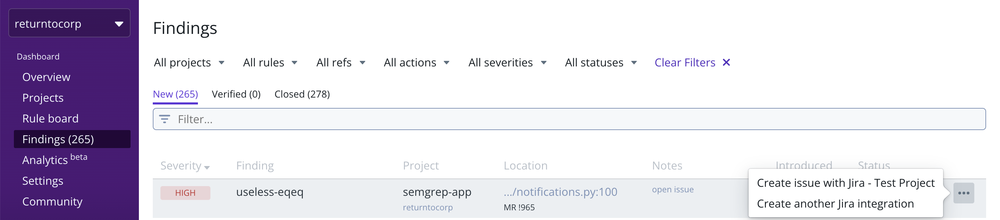

import MoreHelp from "/src/components/MoreHelp"

# Integrations

Semgrep App contains third party integrations to allow users to add data from Semgrep to other tools that are part of their workflows.

Currently, Semgrep App integrates with the following tools:

| Tool | Tier availability |
| ---- | ---------------- |
| Slack | Community (Free) |
| Email | Community (Free) |
| Jira | Team |
| Amazon S3 | Team |
| Webhook | Team |

## Where are integrations found?

After logging into your Semgrep App account, you can find **Integrations** as a tab within **Settings.**

 

View your saved integration channels by clicking on the **gear** icon within the **Rule board**. Click on the toggles to turn notifications on or off for each channel.

 

## Slack

Integrating with Slack allows Semgrep to send findings to a channel on your Slack workspace.

To set it up, you'll need to create an app within Slack and enable that app's **Incoming Webhooks** feature. By creating a webhook, you'll have a URL which serves as Semgrep's endpoint to your Slack workplace.

The guide below will walk you through those steps.

1. Make sure that you're logged into your Slack account. You can enter your login details [here.](https://slack.com/workspace-signin)
2. Follow this [link](https://api.slack.com/apps?new_app=1) to create an app in your Slack workplace. Select **From scratch** and fill in the fields for your app's name and workspace.

 

3. You will be redirected to your new app's settings page. Alternatively, you can find this page by viewing your apps [here](https://api.slack.com/apps) and selecting your integration app from the menu.
4. Click on **Incoming Webhooks** on the left menu, then enable the toggle.
5. Once you've enabled **Incoming Webhooks**, you'll either be able to generate a **Webhook URL** or request one from a workspace owner.

 

6. After you've obtained the URL, return to Semgrep and create a new Slack integration. Name the integration and copy-paste the URL into the **Slack URL** field. You may opt to select the **Inventory** flag to include notifications about Code Asset Inventory findings.
7. You can **Test** then select which channel you'd like Semgrep to start posting to.

 

8. After you've verified that everything is working, remember to **Save** the final configuration.
9. Remember to turn notifications on by going to the **Rule board**, clicking on the **gear icon,** then clicking on the toggle.

### References and useful links

* https://api.slack.com/apps
* https://api.slack.com/messaging/webhooks#enable_webhooks

### See also

[Notifications -> Slack](notifications.md/#slack)

## Email

Proposed outline:
Email integration allows Semgrep to send new findings to an email address of your choice.
1. Introduction, functionality: "Email integration allows you..."
2. How to set it up (with screenshots)
3. What it looks like in an email client (such as Gmail)

### See also
[Notifcations -> Email](notifications.md/#email)

## Jira

Jira integration is a feature available in Semgrep's Team tier and above.

This integration allows you to create JIRA tickets directly from the **Findings** page with relevant information about a particular finding.

## Amazon S3

(See above for proposed ouline)

## Webhooks

Webhooks are a feature available in Semgrep's team tier and above.

Webhooks are a generic method for Semgrep to POST JSON-formatted findings after each scan to your URL endpoint. Simply provide a **Name** and **Webhook URL.** 

Here's the output of a succesful test:

### See also:

[Notifcations -> Webhooks](notifications.md/#webhooks)

<MoreHelp />
