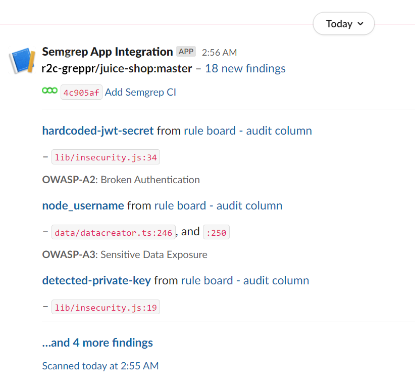
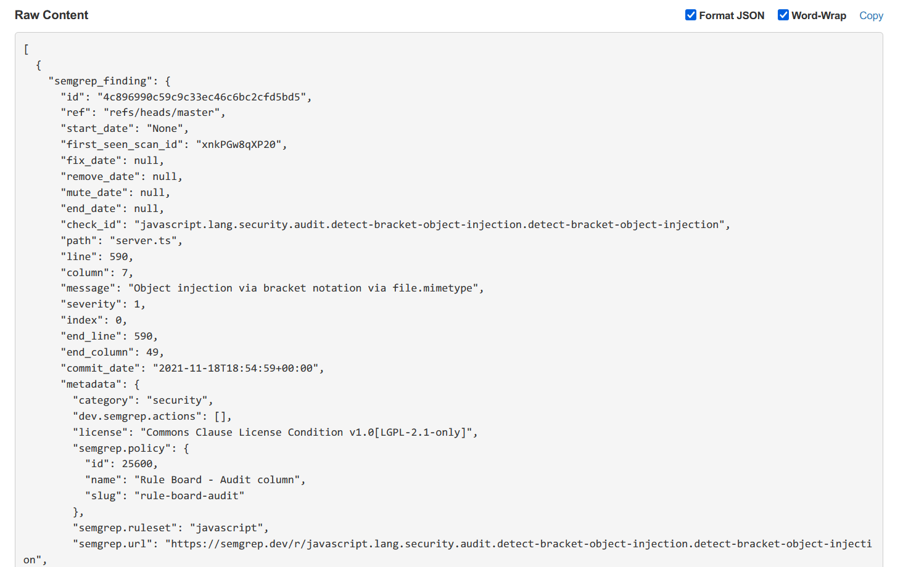

import MoreHelp from "/src/components/MoreHelp"

# Integrating Semgrep App with third-party tools

Semgrep App contains third-party integrations to allow you to add data from Semgrep to other tools that are part of your workflows.

Currently, Semgrep App integrates with the following tools:

| Tool | Tier availability |
| ---- | ---------------- |
| Slack | Community (Free) |
| Email | Community (Free) |
| Jira | Team/Enterprise |
| Amazon S3 | Team/Enterprise |
| Webhook | Team/Enterprise |

## Finding available integrations

To find available integrations for Semgrep App, follow these steps:

1. Sign in to your [Semgrep App account](https://semgrep.dev/).
2. Click **Settings**.
3. Click **Integrations**.

 

## Managing integrations

To view, disable, or enable your saved integration channels:

1. In the **Integrations** tab, click the **gear** icon within the **Rule board**.
2. Select the toggles to turn notifications on or off for each channel.

 

## Integrating various third-party tools

This section describes how to integrate Semgrep App into particular third-party tools.

### Slack

Integrating with Slack allows Semgrep to send findings to a channel on your Slack workspace.

To set it up, create an app within Slack and enable that app's **Incoming Webhooks** feature. By creating a webhook, you'll have a URL that serves as Semgrep's endpoint to your Slack workplace. Follow the guide below to create the app and webook, and integrate with Semgrep:

1. Log in to your Slack account. Enter your login details in [Slack workspace](https://slack.com/workspace-signin).
2. Create an app in your Slack workplace by following this link: [Slack apps](https://api.slack.com/apps?new_app=1).
3. Select **From scratch** and fill in the fields for your app's name and workspace.

4. You will be redirected to your new app's settings page. Alternatively, you can find this page by viewing your apps [here](https://api.slack.com/apps) and selecting your integration app from the menu.
5. Click on **Incoming Webhooks** on the left menu, and then enable the toggle.
6. After you have enabled **Incoming Webhooks**, follow one of these steps:
    - Generate a **Webhook URL**.
    - Request to add a new webhook from a workspace owner.
7. After you've obtained the Webhook URL, return to Semgrep and create a new Slack integration. Name the integration and copy-paste the URL into the **Slack URL** field. You may opt to select the **Inventory** flag to include notifications about Code Asset Inventory findings.
8. You can **Test** then select which channel you'd like Semgrep to start posting to.
 
9. After you've verified that everything is working, remember to **Save** the final configuration.
10. Remember to turn notifications on by going to the **Rule board**, clicking on the **gear icon,** then clicking on the toggle.

Here is a sample of a Slack message sent from Semgrep with findings:

 

#### Additional resources

* https://api.slack.com/apps
* https://api.slack.com/messaging/webhooks#enable_webhooks

#### See also

[Notifications -> Slack](notifications.md/#slack)

### Email

Email integration allows Semgrep to send new findings to an email address of your choice.

To set up email integration:

1. In **Integrations,** click **Add Integration.**
2. Click on **Email**.
3. Enter a **Name** for the integration.
4. Enter the **Email address** that will receive Semgrep findings.
5. Select the **Inventory** check box if you would like to receive notifications about Code Asset Inventory findings.
6. Click **Save.**
7. Remember to turn notifications on by going to the **Rule board**, clicking on the **gear icon,** then clicking on the toggle.

Here is a sample of an email sent from Semgrep with findings:

 

#### See also
[Notifcations -> Email](notifications.md/#email)

### Jira

Jira integration is a feature available in Semgrep's Team tier and above.

This integration allows you to create Jira tickets directly from the **Findings** page with relevant information about a particular finding.

To set up Jira integration:

1. In **Integrations,** click **Add Integration**.
2. Click on **Jira.**
3. Enter a **Name** for the integration.
4. Enter the **email address** used for the Atlassian account.
5. Enter your Atlassian **domain URL**.
6. Enter your **Project key**. This is the prefix for tasks created within a project. Semgrep will create issues to the project identified here.
7. Enter the **Issue type.** This is the type of issue for Semgrep findings, for example, *Bug.*
8. Enter the **API Token**. Tokens are generated through this link: [Manage API Tokens](https://support.atlassian.com/atlassian-account/docs/manage-api-tokens-for-your-atlassian-account).
9. Click **Save.**

To create a Jira ticket from Semgrep:

1. In **Findings**, click on the **three-dot icon** of the entry to create a Jira ticket for the finding.
 
2. Select **Create issue with Semgrep Jira Integration.**

### Webhooks

Webhooks are a feature available in Semgrep's Team tier and above.

Webhooks are a generic method for Semgrep to post JSON-formatted findings after each scan to your URL endpoint.  To set up a webhook:

1. In **Integrations,** click **Add Integration.**
2. Click **Webhook.**
3. Enter a **Name** for the integration.
4. Enter the **Webhook URL.**
5. Select the **Inventory** check box if you would like to receive notifications about Code Asset Inventory findings.
6. To ensure that Semgrep can post to your URL, click **Test.** 
 
7. Click **Save.**
8. Remember to turn notifications on by going to the **Rule board**, clicking on the **gear icon,** then clicking on the integration's toggle.

Here is a sample of a webhook sent from Semgrep with findings:

 

#### See also:

[Notifcations -> Webhooks](notifications.md/#webhooks)

### Amazon S3

1. In **Integrations,** click **Add Integration**.
2. Click **AWS S3**.
3. Enter the **Channel name** for the integration.
4. Select the **Inventory** check box if you would like to receive notifications about Code Asset Inventory findings.
5. To ensure that Semgrep can post to your channel, click **Test**.
6. Click **Save.**
7. Remember to turn notifications on by going to the **Rule board**, clicking on the **gear icon,** then clicking on the integration's toggle.

<MoreHelp />
