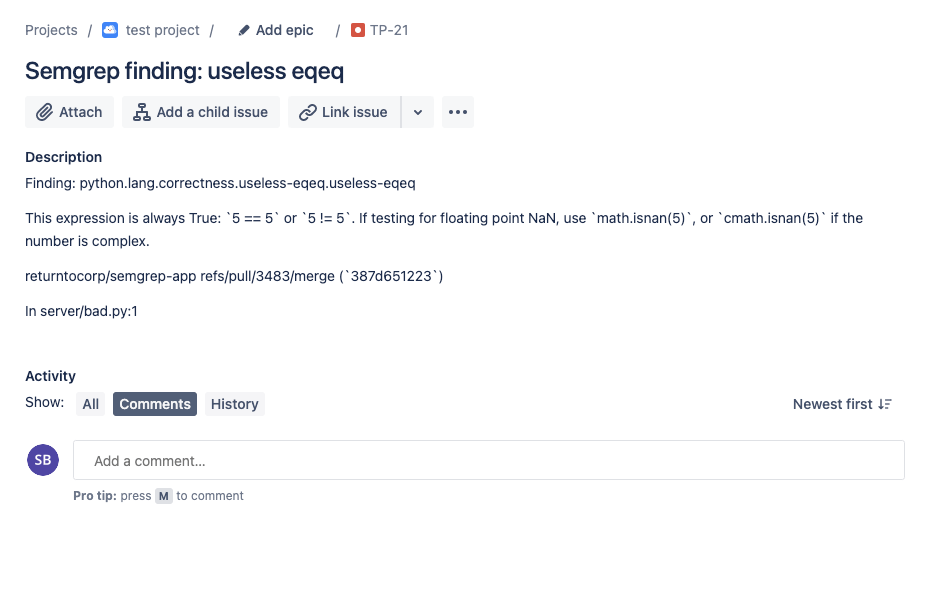

import MoreHelp from "/src/components/MoreHelp"

# Integrations

Semgrep App contains 3rd party integrations to allow users to add data from Semgrep to other tools that are part of their workflows.

Currently, Semgrep App integrations with the following tools:

| Tool | Tier availability |
| ---- | ---------------- |
| Slack | Community |
| Email | Community |
| Jira | Team |
| Amazon S3 | Team |
| Webhook | Team |

## Slack

Proposed outline:
1. Introduction, functionality: "The Slack integration allows you..."
2. How to set it up (with screenshots)
3. What it looks like in Slack

See also: Notifications -> Slack

## Email

Proposed outline:
1. Introduction, functionality: "Email integration allows you..."
2. How to set it up (with screenshots)
3. What it looks like in an email client (such as Gmail)

See also: Notifcations -> Email

## Jira

The Jira integration allows you to create tickets directly from the Findings page with relevant info about a particular finding.

## Amazon S3

(See above for proposed ouline)

## Webhooks

See also: Notifcations -> Webhooks

<MoreHelp />
