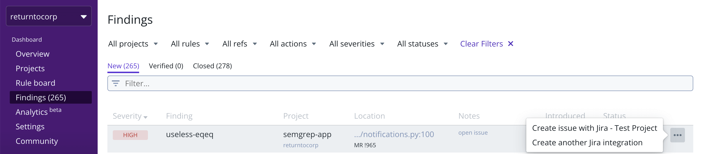

import MoreHelp from "/src/components/MoreHelp"

# Integrations

Semgrep App contains third-party integrations to allow you to add data from Semgrep to other tools that are part of your workflows.

Currently, Semgrep App integrates with the following tools:

| Tool | Tier availability |
| ---- | ---------------- |
| Slack | Community (Free) |
| Email | Community (Free) |
| Jira | Team |
| Amazon S3 | Team |
| Webhook | Team |

## Finding available integrations

To find available integrations for Semgrep App, follow these steps:

1. Sign in to your [Semgrep App account](https://semgrep.dev/).
2. Click **Settings**.
3. Click **Integrations**.

 

To turn notifications for each channel on or off, click on the **gear** icon within the **Rule board.** Then click on the toggles to turn notifications on or off for each channel.
 

## Slack

Integrating with Slack allows Semgrep to send findings to a channel on your Slack workspace.

To set it up, you'll need to create an app within Slack and enable that app's **Incoming Webhooks** feature. By creating a webhook, you'll have a URL which serves as Semgrep's endpoint to your Slack workplace.

The guide below will walk you through those steps.

1. Log in to your Slack account. Enter your login details in [Slack workspace](https://slack.com/workspace-signin).
2. Create an app in your Slack workplace by following this link: [Slack apps](https://api.slack.com/apps?new_app=1).
3. Select **From scratch** and fill in the fields for your app's name and workspace.
 

3. You will be redirected to your new app's settings page. Alternatively, you can find this page by viewing your apps [here](https://api.slack.com/apps) and selecting your integration app from the menu.
4. Click on **Incoming Webhooks** on the left menu, then enable the toggle.
6. After you have enabled **Incoming Webhooks**, follow one of these steps:
    - Generate a **Webhook URL**.
    - Request to add a new webhook from a workspace owner.
6. After you've obtained the Webhook URL, return to Semgrep and create a new Slack integration. Name the integration and copy-paste the URL into the **Slack URL** field. You may opt to select the **Inventory** flag to include notifications about Code Asset Inventory findings.
7. You can **Test** then select which channel you'd like Semgrep to start posting to.
 

8. After you've verified that everything is working, remember to **Save** the final configuration.
9. Remember to turn notifications on by going to the **Rule board**, clicking on the **gear icon,** then clicking on the toggle.

### References and useful links

* https://api.slack.com/apps
* https://api.slack.com/messaging/webhooks#enable_webhooks

### See also

[Notifications -> Slack](notifications.md/#slack)

## Email

Email integration allows Semgrep to send new findings to an email address of your choice.

To set up email integration, provide a **Name** and **Email address.** Check the **Inventory** box if you would like to receive notifications on Code Asset Inventory findings as well.

[insert screenshot of finding in email]

### See also
[Notifcations -> Email](notifications.md/#email)

## Jira

Jira integration is a feature available in Semgrep's Team tier and above.

This integration allows you to create JIRA tickets directly from the **Findings** page with relevant information about a particular finding.

## Amazon S3

(See above for proposed ouline)

## Webhooks

Webhooks are a feature available in Semgrep's team tier and above.

Webhooks are a generic method for Semgrep to post JSON-formatted findings after each scan to your URL endpoint. Simply provide a **Name** and **Webhook URL.** 

### See also:

[Notifcations -> Webhooks](notifications.md/#webhooks)

<MoreHelp />
