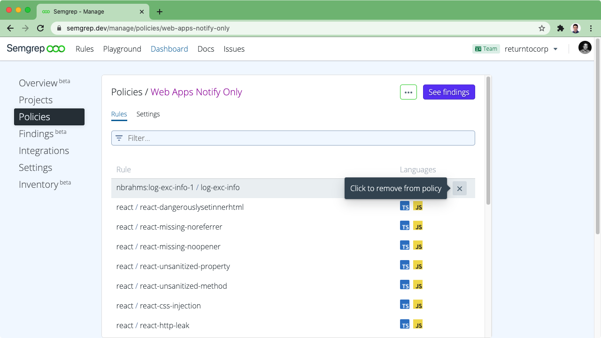
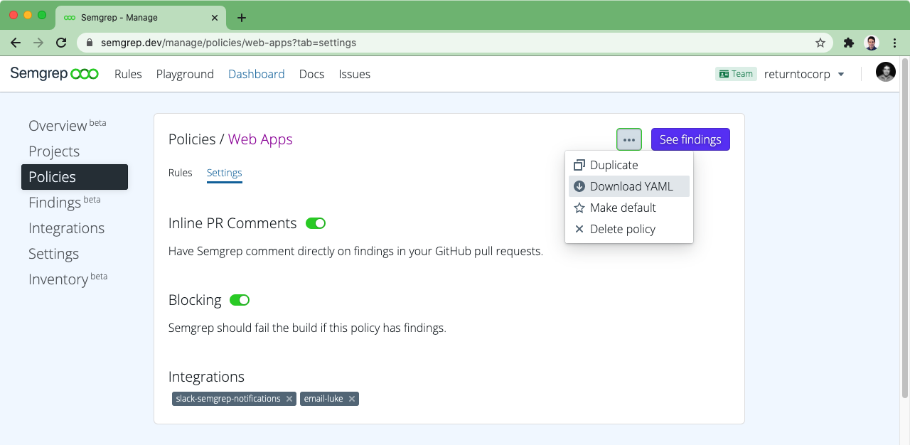

import MoreHelp from "/src/components/MoreHelp"

# Managing CI policy

:::info

  Policy management is an advanced feature
  for orchestrating complex
  rule and notification channel assignments.

  Policy management is available to all users on the Enterprise and Team tiers,
  and to Community tier users who signed up before September 15, 2021.
  Community tier users who signed up after September 15, 2021
  should use the [Rule board](rule-board.md) instead.

:::

Semgrep App provides infrastructure for managing Semgrep across many projects. Gather related rules together in "policies" and apply those policies to projects in a many-to-many mapping. A policy is simply a collection of rules, and a definition of what to do with their results: send notifications to third-party services like Slack, post inline pull request comments on GitHub, and/or block the build by returning a non-zero status.


## Creating a policy

To create a policy, visit [Dashboard > Policies](https://semgrep.dev/manage/policies) and select the plus in the top right corner. To copy the contents of one policy into another, navigate to the existing policy, find "Duplicate" in the "..." menu, and then enter the name of the new policy when prompted.

Policies are often broken down by problem area (e.g., `xss`), application type (e.g., `prod-python-backend`), or blocking status (e.g., `notify-only`). There is no right way to group rules, and what makes the most sense will vary by team and organization.

## Editing a policy

Any rule, ruleset, or pattern can be added to a policy. Look for the “Add to Policy” button when exploring [pre-written rules and rulesets](https://semgrep.dev/explore) or customize your policies even further by adding rules you write yourself in the [online playground](https://semgrep.live).


You can remove items from your policy by hovering over them in the rules tab and clicking the `x` that appears.



## Custom Rule Messages

You can edit a rule's message description by hovering over it in the rules tab and clicking the pencil that appears. This feature is available on the Team tier. 


If you edit the rule to show a customized message, then the new rule message will appear in your PR/MR comments. 


## Changing policy actions

[Third-party notifications](../notifications/),
posting [inline pull request comments](../notifications/#pull-request-comments),
and blocking the build are all configured on a per-policy basis.

1. Visit [Dashboard > Integrations](https://semgrep.dev/manage/integrations) to configure the services and name each of your integration channels. See [Integrations](../notifications/) for detailed instructions.
2. Attach existing integration channels on either [Dashboard > Integrations](https://semgrep.dev/manage/integrations) or an individual policy page.

You can also toggle on and off the abilities to post [pull request comments](../notifications/#pull-request-comments) or to block the build on findings. Don't forget to click Save when you are finished editing!



If you wish to take different actions for rules on the same project, create two different policies, and then attach both policies to the project in question on [Dashboard > Projects](https://semgrep.dev/manage/projects).

## Downloading a policy

To locally test and run a policy, select your policy at [Dashboard > Policies](https://semgrep.dev/manage/policies) and use the “Download YAML” button from the "..." menu. This YAML file can then be run locally via:

```bash
semgrep --config <path/to/yaml> <path/to/code>
```

:::tip
See [Getting started](/getting-started/) for instructions on downloading and running Semgrep locally.
:::

## Assigning a policy to a project

To use policies besides the "default" policies in CI, visit [Dashboard > Projects](https://semgrep.dev/manage/projects) and select the project you wish to edit. You can add as many policies as you would like, and if none are added then the default policies will be run.

## Changing your default policies

To change which policies are labeled as "Default" navigate to the individual policy pages and select "Set default" or "Unset default" from the "..." menu at top right. You must have at least one 
default policy and can have multiple default policies if you wish.

Default policies will be run on projects for which no policies are specified. They will _not_ be run automatically on projects for which policies _are_ specified.

<MoreHelp />
