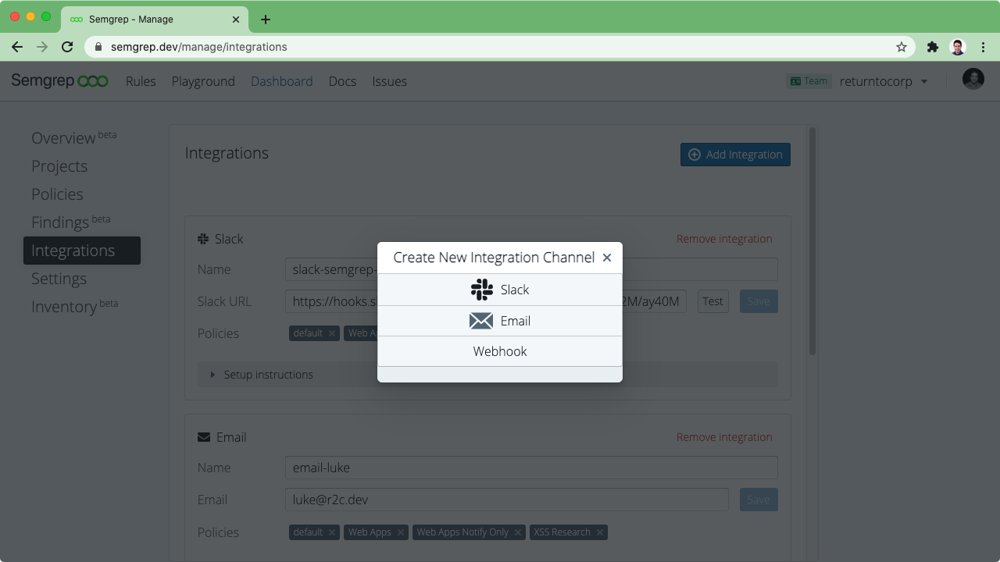

import MoreHelp from "/src/components/MoreHelp"

# Notifications

Semgrep CI integrates with 3rd party services when connected to Semgrep App.
When integrations are configured, you can receive notifications about Semgrep CI findings and failures.

## De-duplication

Notifications are sent only the first time a given finding is seen.

Because of Semgrep CI's diff-awareness, you will not be notified
when a pull request has a finding that existed on the base branch already,
even if that line is moved or re-indented.

Semgrep App also keeps track of notifications that have already been sent,
so consecutive scans of the same changes in the same pull request
won't send duplicate notifications.

## Notification channels

### Slack


<br />
A Slack notification triggered by new findings in a pull request

To receive Slack notifications about Semgrep findings on pull requests and code pushes, visit [Dashboard > Integrations](https://semgrep.dev/manage/integrations) and select 'Add integration' or 'Setup First Integration' and then choose 'Slack'. Give your channel a name, and then follow the setup instructions on the page to retrieve your Webhook URL.



Use the 'Test' button to send a test notification and ensure that your channel is configured properly.


### Email

To receive email notifications about Semgrep findings on pull requests and code pushes, visit [Dashboard > Integrations](https://semgrep.dev/manage/integrations) and select 'Add integration' or 'Setup First Integration,' and then choose 'Email'. Enter your email address, give the channel a name of your choosing, and then click 'Save'.

On each scan that has at least one finding, you will receive one email from Semgrep with a summary of all of the findings from that scan.

### GitHub pull request comments

Pull request comments are left when

1. Semgrep finds a result in CI, and
2. [the CI policy has pull request comments enabled](managing-policy.md#changing-policy-actions)
3. the Semgrep GitHub App has been granted permissions to post inline PR comments.

Automated comments on GitHub pull requests look like this:


<br />
An inline GitHub pull request comment.

Note that [Semgrep App](https://semgrep.dev/manage) uses the permissions requested by [the Semgrep GitHub App](https://github.com/marketplace/semgrep-dev) to leave PR comments.

If you are using Github Actions to run Semgrep, no extra changes are needed to get PR comments. If you are using another CI provider, in addition to the environment variables you set after following [sample CI configurations](/semgrep-ci/sample-ci-configs/) you need to ensure that the following environment variables are correctly defined:

- `SEMGREP_COMMIT` is set to the full commit hash of the code being scanned (e.g. `d8875d6a63bba2b377a57232e404d2e367dce82d`)
- `SEMGREP_PR_ID` is set to the PR number of the pull request on Github (e.g. `2900`)
- `SEMGREP_REPO_NAME` is set to the repo name (e.g., `returntocorp/semgrep`)

### GitLab merge request comments

Merge request comments are currently supported for gitlab.com users only. [Sign up for the GitLab beta](https://go.r2c.dev/join-gitlab-beta) if you have a self-hosted instance of GitLab and are interested in receiving MR comments.

Automated comments on GitLab merge requests look like this:

<br />
An inline GitLab merge request comment left by a custom Semgrep rule

To enable MR comments:

1. Log into Semgrep's [Dashboard > Settings](https://semgrep.dev/manage/settings) to obtain your deployment ID and an API token.
2. Examine your policy settings by navigating to your [policy settings](https://semgrep.dev/manage/policies/starter-policy?tab=settings). Make sure that PR comments are enabled (MR comments and PR comments are enabled by the same toggle switch).
3. Create an API token on gitlab.com by going to [Profile > Access Tokens](https://gitlab.com/-/profile/personal_access_tokens) and adding a token with `api` scope.
4. Copy the token that GitLab gives you.
5. Navigate to your repository's Settings > CI/CD, scroll down to 'Variables', and click 'Expand'. The url will end with something like: /username/project/-/settings/ci_cd.
6. Click to 'Add variable', give the new variable the key `PAT` and use the token you copied in step 2 as the value. Select "mask variable" and **UNSELECT "protect variable"**.
7. Update your .gitlab-ci.yml to pass the content of your PAT in through the environment variable `GITLAB_TOKEN`. 

For example:
```yaml
semgrep:
  image: returntocorp/semgrep-agent:v1
  script:
    # SEMGREP_APP_TOKEN can be obtained from semgrep.dev/manage/settings. 
    # The SEMGREP_APP_TOKEN should be treated like a secret and not hard-coded into your code.
    - semgrep-agent --publish-token $SEMGREP_APP_TOKEN
  rules:
  # Scan changed files in MRs, block on new issues only (existing issues ignored)
  - if: $CI_MERGE_REQUEST_IID
  # Scan all files on default branch, block on any issues
  # - if: $CI_COMMIT_BRANCH == $CI_DEFAULT_BRANCH

  variables:
    SEMGREP_AGENT_DEBUG: 1
    # Gives Semgrep permission to post inline comments
    GITLAB_TOKEN: $PAT
```

Note: GitLab MR comments are only available to logged-in semgrep.dev users, requiring both a Semgrep deployment ID and a Semgrep API token.

### Webhooks

Webhook notifications are a paid feature in the Semgrep Team tier.

To receive webhook notifications on pull requests and code pushes, visit [Dashboard > Integrations](https://semgrep.dev/manage/integrations) and select 'Add integration' or 'Setup First Integration,' and then choose 'Webhook'. Enter a target URL, give the notification channel a name of your choosing, and then click 'Save'.

#### Findings

The URL will receive a POST request for each new finding.
If one scan returns eight findings, eight separate requests will be sent.

```json
{
  "semgrep_finding": {
    "id": "241dbe518caf15f800131d2d0c70bf08",
    "mute_date": null,
    "assigned_date": null,
    "assigned_by_user_id": null,
    "ref": "refs/pull/2658/merge",
    "start_date": "None",
    "fix_date": null,
    "end_date": null,
    "check_id": "log-exc-info",
    "path": "server/semgrep_app/handlers/registry.py",
    "line": 185,
    "column": 9,
    "message": "Error messages should be logged with `exc_info=True` in order to propagate\nstack information to Sentry. Either change the logging level or raise an Exception.\n",
    "severity": 1,
    "index": 0,
    "end_line": 187,
    "end_column": 10,
    "commit_date": "2021-06-07T15:26:35+03:00",
    "metadata": {
      "dev.semgrep.actions": [],
      "semgrep.policy": {
        "id": 8168,
        "name": "Web Apps Notify Only",
        "slug": "web-apps-notify-only"
      },
      "semgrep.ruleset": "johndoe:log-exc-info",
      "semgrep.url": "https://semgrep.dev/s/johndoe:log-exc-info"
    }
  }
}
```

#### Scan

The URL will receive a POST request for each new scan.

```json
{
  "semgrep_scan": {
    "deployment_id": 1,
    "started_at": "2021-09-21T23:49:17.480929+00:00",
    "completed_at": null,
    "exit_code": null,
    "repository": "returntocorp/semgrep-app",
    "ci_job_url": "https://github.com/returntocorp/semgrep-app/actions/runs/1236121005",
    "environment": "",
    "commit": "e22f08e8e871bde8c100b3a4a6f8e9387d651223",
    "commit_committer_email": "",
    "commit_timestamp": "",
    "commit_author_email": "support@r2c.dev",
    "commit_author_name": "Semgrep User",
    "commit_author_username": "semgrepuser",
    "commit_author_image_url": "https://avatars.githubusercontent.com/u/29760937?s=200&v=4",
    "commit_authored_timestamp": "",
    "commit_title": "fixup",
    "config": "",
    "on": "pull_request",
    "branch": "refs/pull/3483/merge",
    "pull_request_timestamp": "",
    "pull_request_author_username": "semgrepuser",
    "pull_request_author_image_url": "https://avatars.githubusercontent.com/u/29760937?s=200&v=4",
    "pull_request_id": "3483",
    "pull_request_title": "test bad commit",
    "ignored_files": ["/server/semgrep_app/templates/"],
    "id": "xnkPGY8VL20o"
  }
}
```

<MoreHelp />
