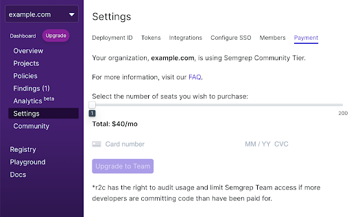

import MoreHelp from "/src/components/MoreHelp"

# Pricing and billing

The following Semgrep tools are free to use:

* Semgrep CLI
* Semgrep CI
* Semgrep App (through the Community tier)

Semgrep CLI is free open-source software (FOSS), licensed under LGPL 2.1. It is a fast static analysis command line tool for finding bugs and enforcing code standards. Semgrep CI is a source-available Docker image for running Semgrep in CI environments. All features for both Semgrep CLI and Semgrep CI are free.

Semgrep App, which builds on Semgrep CLI and CI, enables developer and security teams to create their own institutional code standards, enforce them, and analyze findings. Semgrep App has both free and paid tiers.

## Choosing a Semgrep App tier

Semgrep App has three tiers:

| Tier | Price | Description |
| ---- | ------- | -------- |
| **Community** | Free | For general-purpose security scanning.  |
| **Team** | US$40 monthly per developer | For the enforcement of company-specific coding standards, private rules, and the analysis of findings.  |
| **Enterprise** | Custom pricing | For custom solutions, including deployment into virtual private clouds (VPCs) with dedicated technical support.  |

Semgrep App integrates with a GitHub or GitLab account at either the organizational or individual level. There is no limit to the number of members in an organization for all tiers.

Billing depends on the number of **developers**. Any organization member who has made a commit in a project within the past 30 days is considered a **developer**.

Members who do **not** make any commits on the code do not need to pay for Semgrep and are not billed. Semgrep Team tier features apply to the entire organization, even if not all members are billed.

### Comparing free and paid tier features

#### Organizational management and usage limits

| Feature  | Community | Team | Enterprise |
| -------  | --------- | ------- | -------- |
| **Member limit** | 20 developers | ♾️  unlimited | ♾️  unlimited |
| **Project limit** |♾️  unlimited | ♾️  unlimited | ♾️  unlimited |

Notes:

* Member usage limits are visible in your [settings page](https://semgrep.dev/orgs/-/settings).
* If your organization exceeds the member limit:
    * Only the 20 most recent developers can view findings from Semgrep scans.
    * Overlimit findings data is retained for three months. When your organization goes below the usage limit, or upgrades to Team or Enterprise, the findings data will be accessible again.
    * You are notified of a 30-day grace period through in-app notifications and emails. After this grace period ends, additional developers (the 21st onwards) will not receive notifications or comments. Findings introduced by additional developers won't be surfaced in Semgrep App.

#### Source code management (SCM) support

| Feature  | Community | Team | Enterprise |
| -------  | --------- | ------- | -------- |
| **GitHub**  | ✔️ yes | ✔️ yes | ✔️  yes |
| **GitLab SaaS**  | ✔️ yes | ✔️ yes | ✔️  yes |
| **GitHub Enterprise**  | ❌ no | ✔️  yes | ✔️  yes |
| **GitLab Self Managed**  | ❌ no | ✔️  yes | ✔️  yes |
| **VPC deployment** | ❌ no | ❌ no | ✔️  yes |

#### Findings, language support, and rules

| Feature  | Community | Team | Enterprise |
| -------  | --------- | ------- | -------- |
| **Custom rules** | ✔️ yes | ✔️ yes | ✔️  yes |
| **Community rule registry** | ✔️ yes | ✔️  yes  | ✔️  yes |
| **Editor** | ✔️ yes | ✔️ yes | ✔️  yes |
| **Autofix through PR/MR comments** | ❌ no | ✔️ yes | ✔️  yes |
| **Custom rule messages** | ❌ no | ✔️  yes | ✔️  yes |
| **DeepSemgrep** | ❌ no | ✔️  yes | ✔️  yes |
| **Developer feedback** | ❌ no | ✔️ yes | ✔️  yes |
| **Private rules** | ❌ no | ✔️ yes | ✔️  yes |
| **Custom language support** | ❌ no | ❌ no | ✔️  yes |
| **Findings retention** | 1 month | 5 years | 5 years |

Notes:

* **Custom rules** are rules that you can create and save through either the [Playground](https://semgrep.dev/playground) or the Editor. The Playground and the [Editor](../editor) are online tools where you can write your rule patterns and test them on sample code. You must be signed in to use the Editor.
* Developers can create fixes to their rules through an `autofix` key. For example, when banning outdated libraries, setting an autofix value with the correct library replaces the banned library.
* Semgrep App provides this functionality with **Autofix through PR/MR comments**. These comments appear as suggestions that developers can commit with a single click.
* **Custom rule messages** can be applied to public and private rules.
* **DeepSemgrep** enables interfile tracking within a codebase, keeping track of class and function definitions beyond a single file.
* **Developer feedback** is a means for developers to communicate to security or rule-writing teams about a rule's precision. Discover what rules result in false positives and refine them through this feature.

#### Integrations and notifications

| Feature  | Community | Team | Enterprise |
| -------  | --------- | ------- | -------- |
| **Automatic CI/CD integration** | ✔️ yes | ✔️  yes  | ✔️  yes |
| **Email notifications** | ✔️ yes | ✔️  yes  | ✔️  yes |
| **Slack notifications** | ✔️ yes | ✔️  yes  | ✔️  yes |
| **Jira integration** | ❌ no | ✔️  yes | ✔️  yes |
| **Webhook integration** | ❌ no | ✔️  yes | ✔️  yes |

Notes:

* There is no limit to the number of integrations or notification channels. You can make more than one integration of any type.
* **Automatic CI/CD integration** means that repositories added to Semgrep are scanned as part of the code repository's CI pipeline when a pull request is made.
* **Webhook integration** uses a generic webhook to send JSON messages. These messages are triggered when a policy is changed, a new scan runs, or a new finding has emerged.
* **Jira integration** allows organizations to directly create Jira tickets from a finding.

#### Authentication

| Feature                                  | Community | Team | Enterprise |
| ------                                    | --------- | ------- | -------- |
| **GitHub or GitLab single sign-on (SSO)** | ✔️ yes | ✔️  yes  | ✔️  yes |
| **SAML SSO** | ❌ no | ✔️  yes | ✔️  yes |
| **Role-based access control (RBAC)** | ❌ no | ✔️  yes | ✔️  yes |
| **Custom authentication features** | ❌ no |  ❌ no | ✔️  yes |

Notes:

* GitLab SSO is only available for users of GitLab.com. This does not include self-managed GitLab instances.
* Available **RBAC roles** are `admin` and `user`.

#### Support and troubleshooting

| Feature  | Community | Team | Enterprise |
| -------  | --------- | ------- | -------- |
| **Slack support** | Community Slack | Private Slack channel | Private Slack channel |
| **Semgrep support portal** | ❌ no | ✔️  yes | ✔️  yes |
| **Customer success manager** | ❌ no | ❌ no | ✔️  yes |
| **Dedicated and customized onboarding** | ❌ no | ❌ no | ✔️  yes |

Notes:

* Email, phone, and chat support is available 8 hours a day, 5 days a week.
* Request support and track the status of your tickets through the [Semgrep Support Portal](https://support.semgrep.dev/hc/en-us) at any time.

## Determining your plan needs

### Number of developers

Within your team or organization, assess the number of members that make commits. That determines the number of developers needed for the plan purchase.

For example, if a project has 4 unique developers who create commits during the billing period while Semgrep is scanning their repositories, only 4 developers are required even if the organization has a total of 10 members. If these unique developers commit to many projects within the same organization, they are counted once, so no additional cost is charged.

All members of the organization, regardless of developer status, have access to paid features for the chosen tier. This means that project managers and other non-programming roles can still view the Semgrep App dashboard.

### Plan limits

Should your plan exceed the limit, we will reach out and come up with a new plan that fits your needs.

## Upgrading your plan

To upgrade to the **Team tier** through a **credit card**:

1. In the Settings page, select the Payment tab.
2. Select the number of developers to purchase licenses for.
3. Fill in your payment details.

 

To upgrade to the **Enterprise tier**, please [contact us](https://semgrep.dev/contact).

### Billing

Team tier users who pay through a credit card are charged monthly. Enterprise tier users are charged at an agreed-upon billing cycle. For any concerns such as custom payment methods and billing cycles, send an email to [billing@r2c.dev](mailto:billing@r2c.dev) to get in touch with our sales team.

## Modifying or canceling your plan

To modify or cancel your plan, send an email to [billing@r2c.dev](mailto:billing@r2c.dev).

## Paying for your plan

Pay through the following methods: 

<dl>
<dt>Pay using your credit card.</dt>
<dd>The payment will be processed through Stripe.</dd>
<dt>Pay through a purchase order or invoice.</dt>
<dd>Send an email to <a href='mailto:billing@r2c.dev'>billing@r2c.dev</a> to get in touch with our sales team.</dd>
</dl>

## See also

* [Supported languages](https://semgrep.dev/docs/supported-languages/)
* [List of vulnerabilities found and fixed with Semgrep](https://semgrep.dev/docs/trophy-case/)
* [Frequently asked questions](https://semgrep.dev/docs/faq/)

## Additional resources

* [Slack on scaling static analysis with Semgrep](https://r2c.dev/blog/2021/slack-presents-semgrep-at-def-con-appsec-village/) 

<MoreHelp />
