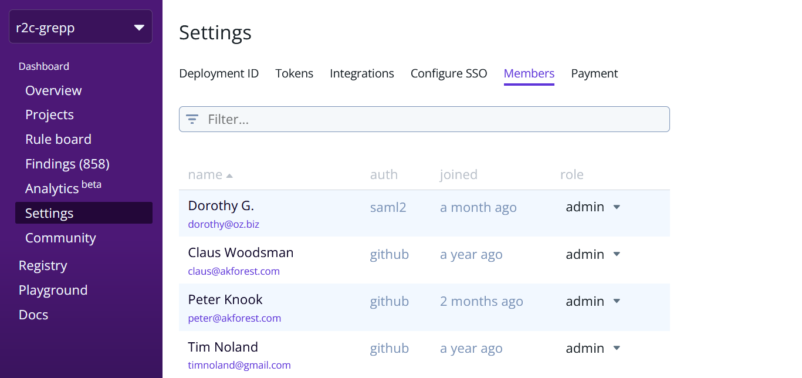

import MoreHelp from "/src/components/MoreHelp"

# Controlling access through roles

 

Access control in Semgrep App determines the resources and features that are available to users based on their role. This **role-based access control (RBAC)** feature is available for organizations on Team/Enterprise tiers.

## Setting up RBAC

Semgrep App divides users into two roles:

* `admin`
* `member`

:::info
Users in organizations without RBAC enabled are `admin` by default.
:::
:::info
Community-tier (Free) users are `admin` by default.
:::

The following table displays features available to each role:

| Feature               | `member`  | `admin`   | Additional notes                                                                   |
| ---------             | --------- | --------- | ---------                                                                          |
| Overview              | yes       | yes       |                                                                                    |
| Projects              | no        | yes       | Only `admin` can manage projects                                                   |
| Rule Board (Policies) | no        | yes       | Only `admin` can manage policies and rules.                                        |
| Findings              | yes       | yes       | Both `admin` and `member` roles can sort, filter, comment on, and triage findings. |
| Analytics             | no        | yes       |                                                                                    |
| Settings              | no        | yes       |                                                                                    |
| Community             | yes       | yes       |                                                                                    |
| Registry              | yes       | yes       |                                                                                    |
| Playground            | yes       | yes       |                                                                                    |
| Docs                  | yes       | yes       |                                                                                    |

See also

* [Internal docs]

Additional references

* [Blog, items outside of semgrep]

<MoreHelp />
