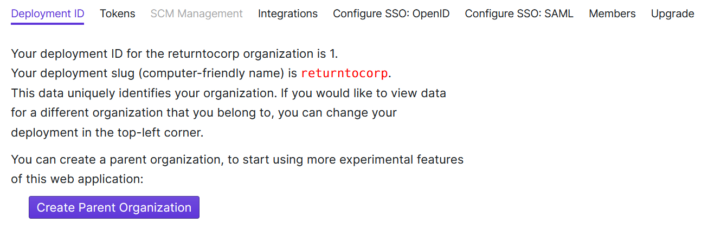
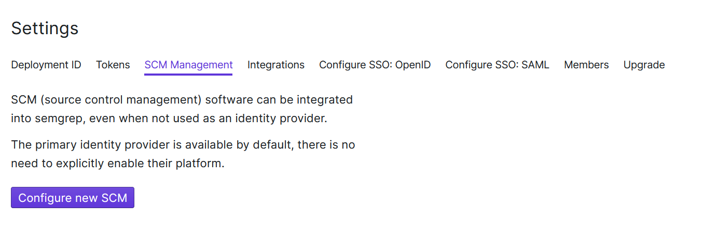

import MoreHelp from "/src/components/MoreHelp"

# Integrating Semgrep into source code management (SCM) tools

Semgrep App's Team tier supports repositories hosted on both **GitHub Enterprise (GHE)** and **GitLab Self Managed (GLSM)** plans. Create multiple integrations in different self-hosted or custom servers.

## Prerequisites

You need the following permissions to integrate Semgrep into GHE or GLSM servers:

* Permission to create a personal access token (PAT) for the repository to scan Semgrep on. This PAT is used to enable Semgrep App to create pull request (PR) or merge request (MR) comments.
* Permission to add CI/CD secrets into your [GitHub](https://docs.github.com/en/actions/security-guides/encrypted-secrets) or [GitLab](https://docs.gitlab.com/ee/ci/secrets/) environments.

## Integrating Semgrep into GitHub Enterprise or GitLab Self Managed 

Integrate Semgrep into these custom source code management (SCM) tools by following the steps below:

1. Sign in to [Semgrep App](https://semgrep.dev/login).
2. Click **[Settings](https://semgrep.dev/orgs/-/settings)** > **Create new parent organization**.

3. Enter the name of your parent organization.
4. Sign out, then sign in again to enable SCM management.
5. Click **Settings** > **SCM management** > **Configure new SCM**.

6. Select your SCM provider.
7. For **GitHub Enterprise**, follow the steps below:
    1. Create a personal access token (PAT) by following the steps outlined in this [guide to creating a PAT](https://docs.github.com/en/enterprise-server@3.1/authentication/keeping-your-account-and-data-secure/creating-a-personal-access-token).
    2. Enter the personal access token generated into the Access Token field.
    3. Enter your GHE base URL into the SCM Base URL.
8. For **GitLab Self Managed**, follow the steps below:
    1. Create a personal access token (PAT) by following the steps outlined in this [guide to creating a PAT](https://docs.gitlab.com/ee/user/profile/personal_access_tokens.html).
    2. Enter the personal access token generated into the Access Token field.
    3. Enter your GLSM base URL into the **SCM Base URL** field.
9. Ensure that your SCM integration successfully detects repositories by following the steps below:
    1. Click **Projects > Setup New Project**.
    2. Select your CI provider.
    3. Semgrep App detects repositories from your SCM integration.
10. Add a new repository by following the steps in [Adding a project](../getting-started-with-semgrep-app/#adding-a-project).

## Additional references
* [Semgrep's May 2022 updates: DeepSemgrep, New Playground, and Self Managed GitHub and GitLab support](https://r2c.dev/blog/2022/semgreps-may-2022-updates/)

<MoreHelp />
