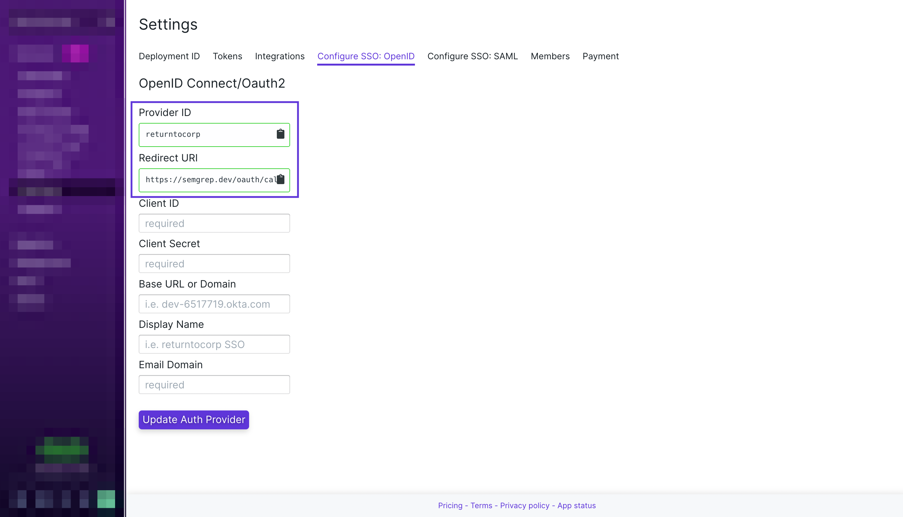
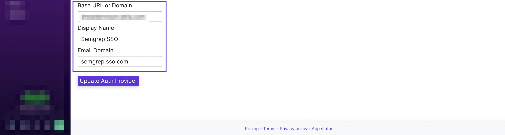

import MoreHelp from "/src/components/MoreHelp"

# SSO Configuration

**SSO (single sign-on)** is a **Team/Enterprise tier feature**. Semgrep supports [OAuth2/OIDC](#oauth2oidc) and [SAML 2.0](#saml-20).

## OAuth2/OIDC

OAuth2/OIDC is configured through the **Semgrep App Dashboard**. 

To set up SSO:

1. From the **App Dashboard**, click on **Settings > Configure SSO: OpenID**.
2. Copy the `Provider ID` and `Redirect URI`.

3.Generate a `Client ID` and `Client Secret` through your authentication provider by pasting `Provider ID` and `Redirect URI` values as needed.

4. From your authentication provider, copy the values for `Base URL/Domain` and `Email Domain` to Semgrep's Configure SSO: OpenID tab. `Base URL/Domain` is `Okta domain` for Okta SSO.
5. Provide a descriptive `Display Name`.

In case you encounter issues during the setup process, please reach out to [support@r2c.dev](mailto:support@r2c.dev) for assistance.

## SAML 2.0

SAML2.0 is configured through the **Semgrep App Dashboard**. 

To set up SSO:

1. From your **authentication provider**, create the **SAML app**.

2. From the **App Dashboard**, click on **Settings > Configure SSO: SAML**.
3. Copy the `Provider ID`, the `Single sign on URL`, and `Audience URI`. Paste the values as needed in your authentication provider.

4. From your authentication provider, add in two attribute statements `name` and `email`.

5. From your authentication provider, copy your `IdP SSO URL`, `IdP Issuer ID`, and `X509 Certificate` to Semgrep's Configure SSO: SAML tab.

6. Provide a descriptive `Display Name`.

If you encounter issues during the setup process, reach out to [support@r2c.dev](mailto:support@r2c.dev) for assistance.

<MoreHelp />
