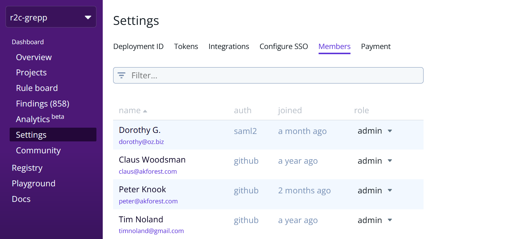

import MoreHelp from "/src/components/MoreHelp"

# Managing users and roles

Accounts enable you to manage access to Semgrep resources, such as scans and findings, with varying levels of collaboration and visibility.

Semgrep App has two types of accounts:

<dl>
    <dt>Personal account</dt>
    <dd>Every person who signs into Semgrep App is first signed in to a <strong>personal account</strong>. In a personal account, your findings, projects, private rules, and scans are visible only to you.</dd>
    <dt>Organization account</dt>
    <dd>To collaborate with others, create an <strong>organization account</strong>. An organization account in Semgrep App requires an existing organization from your source code management (SCM) tool. Creating this type of account integrates Semgrep App into your organization. A user can be part of many Semgrep App organization accounts, provided that they are a member of that organization in their SCM.</dd>
</dl>

Users from the same organization can sign into Semgrep App with their SCM's credentials and are automatically added to the organization account. Semgrep App can also detect the organization's repositories available for scanning.

In organization accounts, collaborators can collectively manage Semgrep App. By default, users can:

* Add projects to scan.
* View and triage findings.
* Determine what rules to run and set up actions that Semgrep App will perform.
* Manage tokens and other settings.
* View an organization's private rules.

Semgrep App can restrict features based on user roles. See [Controlling access through roles](#controlling-access-through-roles).

By creating an organization account, teams can collaborate on rule writing and the management of repositories. Teams with organization accounts can enforce organization-wide standards and secure their repositories at scale.

## Controlling access through roles

 

Access control in Semgrep App determines the resources and features that are available to users based on their role. This **role-based access control (RBAC)** feature is available for organizations on **Team/Enterprise tiers**.

## Setting up RBAC

Semgrep App divides users into two roles:

* `admin`
* `member`

:::info
Users in organizations without RBAC enabled are assigned an `admin` role by default.
:::
:::info
Community-tier (Free) users are assigned an `admin` role by default.
:::

The following table displays features available to each role:

| Feature               | `member`  | `admin`   | Additional notes                                                                   |
| ---------             | --------- | --------- | ---------                                                                          |
| Overview              | yes       | yes       |                                                                                    |
| Projects              | no        | yes       | Only `admin` can manage projects.                                                  |
| Rule Board (Policies) | no        | yes       | Only `admin` can manage policies and rules.                                        |
| Findings              | yes       | yes       | Both `admin` and `member` roles can sort, filter, comment on, and triage findings. |
| Analytics             | no        | yes       |                                                                                    |
| Settings              | no        | yes       |                                                                                    |
| Community             | yes       | yes       |                                                                                    |
| Registry              | yes       | yes       |                                                                                    |
| Playground            | yes       | yes       |                                                                                    |
| Docs                  | yes       | yes       |                                                                                    |

To enable RBAC, please contact r2c at [support@r2c.dev](mailto:support@r2c.dev).

Upon enabling RBAC for the first time, current members of the organization are `admins`. New members added thereafter are automatically `members`.

## Changing a user's role

**Prerequisites**:

* You must be an `admin` to perform this operation.
* You may need to log out and log back in after enabling RBAC for your organization.

To **change a user's role**:

1. On Semgrep App's sidebar, click Settings.
2. Click on the Members tab.
3. Search for the member whose role will be changed.
4. Click on the member's current role, under the role header. A drop-down box appears.
5. Select the new role for the member.

:::info
You cannot change your own role.
:::

<MoreHelp />
