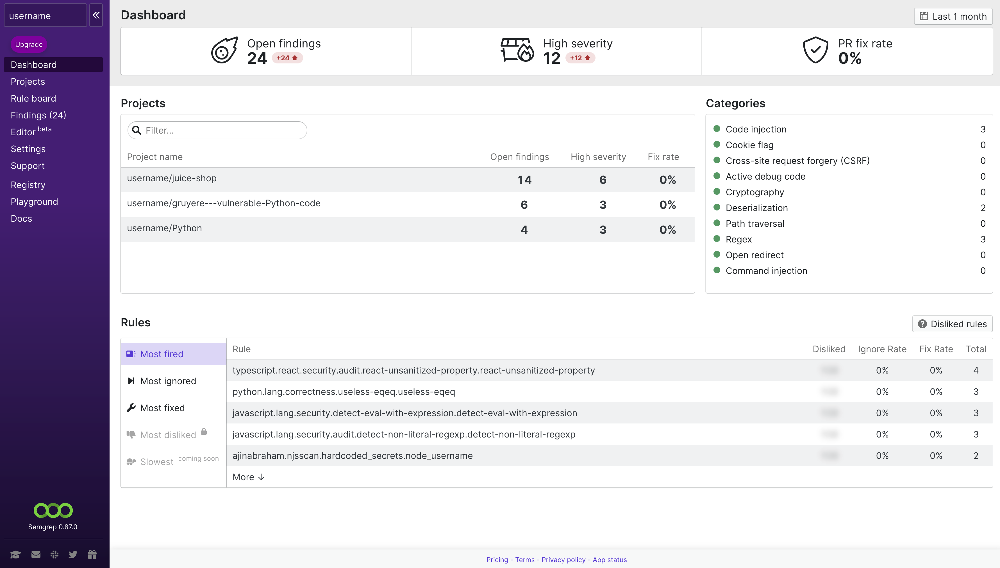

import MoreHelp from "/src/components/MoreHelp"

# Semgrep CI overview

## Introduction

Semgrep CI enables you to run Semgrep in CI environments. You can use it solely for the purpose of checking your code in CI pipeline or connect Semgrep CI to [Semgrep App](https://semgrep.dev/manage) for centralized rule and findings management.

- **Scan every commit**. Semgrep CI rapidly scans modified files on pull and merge requests, protecting developer productivity. Usually, full-project scans are reserved for special branches, such as trunk branches, and diff-aware scans are done on other branches before merging them into the trunk.
- **Block new bugs**. You shouldn’t have to fix existing bugs just to adopt a tool. Semgrep CI reports newly introduced issues on pull and merge requests, scanning them at their base and HEAD commits to compare findings. Developers are significantly more likely to fix the issues they introduced themselves on PRs and MRs.
- **Get findings where you work**. Semgrep CI can connect to [Semgrep App](https://semgrep.dev/manage) to present findings in Slack, on PRs and MRs via inline comments, email, and through 3rd party services.

:::info
Semgrep CI runs fully in your build environment: **your code is never sent anywhere**.
:::

**Note**: Semgrep CI is a subcommand of Semgrep CLI, so you can test the code and behavior of Semgrep CI on your machine by running `semgrep ci`.

## Adding Semgrep CI to your repository

Semgrep CI behaves like other static analysis and linting tools: it runs a set of user-configured rules and returns a non-zero exit code if there are findings, resulting in its job showing a ✅ or ❌.

Copy the relevant template for your CI provider from the sections below. Read through the comments in the template to adjust Semgrep CI scan settings, selecting pull and merge requests, full scans on your branch.

Once Semgrep CI is running, explore the [Semgrep Registry](https://semgrep.dev/explore) to find and add more project-specific rules.

See [Advanced Configuration](#advanced-configuration) for further customizations, such as ignoring files and tuning performance.

### GitHub Actions

:::info
You can add Semgrep CI automatically to a GitHub repository by clicking "Set up" on the [Projects page](https://semgrep.dev/manage/projects) of Semgrep App. You'll be able to adjust pull request and  merge behavior before Semgrep App asks to commit a workflow file to your repository.
:::

To manually add Semgrep CI to GitHub Actions, add a `.github/workflows/semgrep.yml` file to your repository. Follow the [workflow syntax for GitHub Actions](https://docs.github.com/en/actions/reference/workflow-syntax-for-github-actions).

See this [example GitHub Actions workflow configuration](../sample-ci-configs/#github-actions) for Semgrep CI.

### GitLab CI/CD

To add Semgrep CI to GitLab CI/CD, add a `.gitlab-ci.yml` file to your repository if not already present. Add a block to run the Semgrep CI job in your pipeline, following [GitLab’s configuration guide for the .gitlab-ci.yml file](https://docs.gitlab.com/ee/ci/yaml/gitlab_ci_yaml.html).

See this [example GitLab CI/CD configuration](../sample-ci-configs/#gitlab-ci) for Semgrep CI.

If you’re already running [GitLab SAST](https://docs.gitlab.com/ee/user/application_security/sast/) by including `template: Security/SAST.gitlab-ci.yml` in your CI/CD configuration, you can still include and customize Semgrep CI. GitLab SAST, including its `semgrep-sast` analyzer, will continue to run normally.

### Other CI providers

The community successfully ran Semgrep in the following CI platforms (some include a link to sample configuration):

- Bitbucket Pipelines
- Bitrise
- Buildbot
- Buildkite [(sample configuration)](../sample-ci-configs/#buildkite)
- CircleCI [(sample configuration)](../sample-ci-configs/#circleci) 
- Codefresh
- Jenkins [(sample configuration)](../sample-ci-configs/#jenkins)
- TeamCity CI
- Travis CI

To add Semgrep CI to any CI environment, use the [`returntocorp/semgrep`](https://hub.docker.com/r/returntocorp/semgrep) Docker image directly.

For full project scans:

```sh
semgrep scan --config auto --config <other rule or rulesets>
```

If you cannot use the Docker image, install Semgrep CI with `pip install semgrep`.

:::note
`--config auto` sends your repository's project URL to [Semgrep Registry](https://semgrep.dev/r) to find rules configured for your repository and as a key for cached rule recommendations.
:::

## Reviewing Findings

### Scan output

Semgrep CI exits with exit code 1 if the scan returned any findings.
This causes your CI provider to show a ❌ next to the job,
preventing the pull request from being merged. 
You can find a description of the findings in the log output.

<details>
<summary>Click for an example of Semgrep CI's job output</summary>

```sh
Scanning across multiple languages:
         python | 127 rules × 1 file 
    <multilang> |   3 rules × 1 file 
  Current version has 2 findings.
Switching repository to baseline commit 'f74fdbb855f179d2858c487ae25871ef65d2fb09'.
  Will report findings introduced by these commits:
    * a833b40 Update server.py
Scanning 1 file with 2 python rules.
Findings:
  src/server.py 
     python.lang.security.audit.dangerous-system-call.dangerous-system-call
        Found dynamic content used in a system call. This is dangerous if external data can reach
        this function call because it allows a malicious actor to execute commands. Use the
        'subprocess' module instead, which is easier to use without accidentally exposing a command
        injection vulnerability.
        Details: https://sg.run/vzKA
         10┆ os.system(cmd)
Some files were skipped.
  Scan was limited to files changed since baseline commit.
Ran 371 rules on 1 file: 1 finding.
Ran 371 blocking rules, 0 audit rules, and 0 internal rules used for rule recommendations.
Reporting findings to semgrep.dev ...
Success.
Has findings for blocking rules so exiting with code 1
```

</details>
<br />

:::note
Rules are *blocking* by default and behave as described above.
When connected to Semgrep App, you can also add non-blocking rules to your scans.
Non-blocking rules return [non-blocking findings](#getting-notifications-instead-of-blocking-builds) which notify you via an integration but do not show up in log output, and do not cause jobs to fail with a ❌.
:::

### Integrations

For users of Semgrep App, you can integrate Semgrep CI with many other services, to get you results in the workflow you're already used to, whether you're a developer or part of a security team.

#### Notifications

<br />
A Slack notification triggered by new findings in a pull request

Notifications require connection to Semgrep App. You can get notified about new findings via:

- [GitHub pull request comments](/semgrep-app/notifications/#github-pull-request-comments)
- GitLab merge request comments ([sign up for the beta here](https://go.r2c.dev/join-gitlab-beta))
- [Slack messages](/semgrep-app/notifications/#slack)
- [emails](/semgrep-app/notifications/#email)
- [webhooks](/semgrep-app/notifications/#webhooks) (paid feature in Semgrep App)

To set up notifications, see [Notifications document](/semgrep-app/notifications) for more information.

:::note
Notifications are sent only the first time a given finding is seen. [See how notifications are de-duplicated](/semgrep-app/notifications/#de-duplication)
:::

#### Security dashboards

<br />
Semgrep App's findings overview page

The dashboards give you an overview of all your findings organization-wide.
You can review Semgrep CI's findings through the following security dashboards:

- [GitLab SAST Security Dashboard](https://docs.gitlab.com/ee/user/application_security/security_dashboard/) (requires GitLab Ultimate subscription)
- [GitHub Advanced Security Dashboard](https://docs.github.com/en/github/getting-started-with-github/learning-about-github/about-github-advanced-security) (requires GitHub Enterprise subscription)
- [Semgrep App](https://semgrep.dev/manage) (free and paid tiers available)

## Advanced Configuration

### Registry rules and rulesets

:::info
These instructions apply to using Semgrep CI directly in your CI environment. For use with Semgrep App please use the "Add to policy" button next to any registry rule or ruleset, or visit [Dashboard > Policies](https://semgrep.dev/manage/policies).
:::

Semgrep CI accepts a list of rules and rulesets to run on each scan. To add from the [Semgrep Registry](https://semgrep.dev/explore), just include the rule or ruleset identifier in your CI workflow file. Identifiers take the form `p/<ruleset-id>` and `r/<rule-id>`. These identifiers can be copied directly for any rule or ruleset directly from the Registry, and run locally using the `--config <identifier>` flag with the [Semgrep command line tool](/getting-started/#run-semgrep-locally).

For example, in GitLab CI/CD:

```yaml
# ...
 variables:
    SEMGREP_RULES: >-
      p/security-audit
      p/secrets
# ...
```

Key names and configuration format for specific CI providers are available in the [sample CI configurations](../sample-ci-configs/).

### Custom rules

:::info
See [Writing rules](/writing-rules/overview/) to learn how to write custom rules.
:::

Your own custom rules can be added to your Semgrep CI configuration just like [Registry rules](#registry-rules-and-rulesets/) by:

1. Including their [Playground](https://semgrep.dev/editor) share ID (e.g. `s/susan:named-rule`)
2. Adding the directory or file path to the local file containing the rule
3. Adding the rule to a `.semgrep/` directory, which is included by default

For example, in GitLab CI/CD:

```yaml
# ...
 variables:
    SEMGREP_RULES: >-
      s/dlukeomalley:translation-of-non-string  # Playground share ID
      no-exec.yml                               # File containing one or more rules
      .semgrep/                                 # Directory containing rule yaml files 
# ...
```

If no configuration is provided and no `.semgrep.yml` or `.semgrep/` directory exists, Semgrep CI will exit with a non-zero error code.

### Ignoring files

Semgrep CI supports a `.semgrepignore` file that follows the `.gitignore` syntax and is used to skip files and directories during scanning. This is commonly used to avoid vendored and test related code. For a complete example, see the [.semgrepignore file on Semgrep’s source code](https://github.com/returntocorp/semgrep/blob/develop/.semgrepignore).

:::caution
`.semgrepignore` is only used by Semgrep CI and the Semgrep command line tool. It is not honored by integrations like [GitLab's Semgrep SAST Analyzer](https://gitlab.com/gitlab-org/security-products/analyzers/semgrep).
:::

By default Semgrep CI skips files and directories such as `tests/`, `node_modules/`, and `vendor/`. It uses the same default `.semgrepignore` as the CLI, which can be found in the [CLI Reference](https://semgrep.dev/docs/cli-reference/#ignoring-files). This is used by Semgrep CI when no explicit `.semgrepignore` file is found in the root of your project.

For information on ignoring individual findings in code, see the [ignoring findings page](/ignoring-findings/).

### Audit scans

Semgrep CI has an audit mode that can be enabled to suppress non-zero exit codes when findings are found during branch scans. These scans are not differential in nature and by default pre-existing findings will fail the build. With audit mode enabled, even though findings will not cause non-zero exit codes, internal Semgrep errors and exception will still fail the build.

This behavior is beneficial for those who want to ensure every merge to a branch is fully scanned but who don't want to interfere with the development process because of pre-existing issues. In this mode, [security dashboards](#security-dashboards) can still be kept up to date and [notifications](#notifications) can be received.

In GitHub Actions, the most common event names are `push` and `pull_request`. To enable audit mode on branch pushes in GitHub Actions, set the option `auditOn: push` in your workflow file.

In providers other than GitHub Actions and GitLab CI, Semgrep CI doesn't infer an event name from the environment. Therefore, all scan run on an event named `unknown`.

### Exit codes

| Exit code | Meaning |
| --- | --- |
| **0** | Scan completed successfully and found no blocking findings |
| **1** | Scan completed successfully and found blocking findings |
| **2** | Scan failed and printed the error's details |

[Non-blocking findings](#getting-notifications-instead-of-blocking-builds) do not affect the exit code.

### Appendix

#### Ignoring specific rules in a ruleset or policy

You can customize the ruleset you're using to ignore some of its rules by [editing the Semgrep App Rule Board](/semgrep-app/rule-board).

#### Getting notifications instead of blocking builds

Some rules point out hotspots that require careful review but are not certain to be insecure code. You might want to disable blocking when scanning with such rules, and instead use a [CI integration](/semgrep-app/notifications/) to get notifications.

You can set this up through the [Rule Board](/semgrep-app/rule-board).

<MoreHelp />
