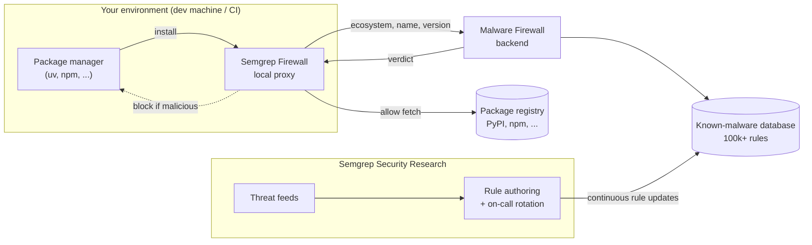

<Note>
The Semgrep Malware Firewall is in private beta. This documentation page is not yet listed in the main navigation.
</Note>

## Overview

The Semgrep Malware Firewall prevents malicious packages from being installed on developer machines. It sits in front of your package installs, checks each requested package against Semgrep's continuously updated database of known malware, and blocks anything that matches.

## How it works



The system has a few parts:

1. A lightweight **client proxy** that runs on every machine (one-time setup via `mfw install`). It sets standard proxy environment variables (`HTTP_PROXY`, `HTTPS_PROXY`) so package managers respect it automatically — no per-tool configuration is needed (for example, no manual `tool.uv.index` setup for `uv`). It watches traffic to known package registry URLs (such as `registry.npmjs.org`), identifies package-download requests specifically (tarballs, wheels, and similar artifacts), and gates those artifact requests on a response from the Semgrep backend before the download completes. All other traffic is proxied through transparently.
2. The Semgrep-operated **malware firewall backend**, which receives requests from the local proxy containing an ecosystem, package name, and version, and replies with a verdict.
3. The Semgrep security-research-maintained **malware database**, with over 100,000 rules based on a variety of threat feeds, kept current by our security research on-call rotation.

The request cycle:

1. On install, the user signs in (`mfw login`); each verdict request is authenticated with a short-lived bearer token.
2. A developer runs a normal package install. The local proxy intercepts each package the installer tries to fetch.
3. For every package, the proxy asks the Semgrep backend whether the package at that specific version is malicious.
4. The backend returns a verdict by matching against the malware database.
5. If the package is safe, the install proceeds normally against the upstream registry. If it matches known malware, the proxy blocks the download and reports why.

### Advisory and database sync SLOs

- For active, high-severity supply-chain incidents (for example, Sha1-Hulud, React2Shell, or Miasma-type events), Semgrep does not wait on [osv.dev](https://osv.dev) to publish — Security Research issues advisories and deploys them within ~30 minutes.
- For all other findings, the malware database syncs from OSV every 2 hours.

### Cooldowns

The firewall does not currently support configuring a cooldown period before a newly published package version can be installed. Cooldowns can be configured at the package-manager level. See [cooldowns.dev](https://cooldowns.dev/) for a guide across ecosystems.

## Reporting

The Semgrep UI shows basic firewall reporting, including scanned and blocked dependencies.

## Prerequisites

- A Semgrep account
- Semgrep Guardian
- macOS or Linux shell access (Terminal)

## Install and verify

<Steps>
    <Step>
    Open Terminal.
    </Step>
    <Step>
    Download and install the firewall:

    ```bash
    curl -fsSL https://semgrep.dev/dist/mfw/install.sh | sh
    ```
    </Step>
    <Step>
    When prompted, confirm with `y`.
    </Step>
    <Step>
    Restart your Terminal / shell so the proxy environment variables take effect.
    </Step>
    <Step>
    Verify the install:

    ```bash
    mfw doctor
    ```

    You should see:

    ```
    Semgrep mfw is protecting this machine ✅
    ```
    </Step>
</Steps>

## Test the firewall

Use a known-safe demo package to confirm the firewall blocks malicious installs without touching real malware.

<Steps>
    <Step>
    Open (or create) a test directory and initialize a project:

    ```bash
    uv init
    ```
    </Step>
    <Step>
    Attempt to install the demo malware package:

    ```bash
    uv add --no-cache semgrep-malware-demo-aws-cred-read
    ```
    </Step>
    <Step>
    **Expected result:** the install is blocked. The firewall should intercept and reject the package.
    </Step>
    <Step>
    To test with a second package manager, repeat with pip:

    ```bash
    pip install --no-cache semgrep-malware-demo-aws-cred-read
    ```
    </Step>
</Steps>

If either install *succeeds* instead of being blocked, treat that as a signal the firewall isn't intercepting traffic correctly (check the `mfw doctor` output, and confirm your shell was restarted after install).

## Uninstalling the firewall

To remove the firewall and its proxy configuration from a machine:

```bash
mfw uninstall
```

This unsets the `HTTP_PROXY` / `HTTPS_PROXY` environment variables that `mfw install` configured and removes the local proxy process. Restart your Terminal / shell afterward to confirm the variables are cleared.

To verify removal:

```bash
mfw doctor
```

It should no longer report `Semgrep mfw is protecting this machine ✅`.

## Troubleshooting `mfw doctor` failure states

| Symptom | Likely cause | Suggested fix |
| :--- | :--- | :--- |
| `mfw doctor` reports the firewall is **not** protecting the machine right after install | Shell wasn't restarted, so `HTTP_PROXY` / `HTTPS_PROXY` aren't set in the current session | Restart Terminal / shell, then re-run `mfw doctor` |
| `mfw doctor` reports an authentication error | User hasn't run `mfw login`, or the short-lived bearer token has expired | Run `mfw login` again |
| Package installs are slow or time out | Local proxy can't reach the Semgrep verdict backend (network or firewall rules blocking egress) | Confirm outbound access to Semgrep's backend is allowed; check corporate proxy or VPN settings |
| A known-safe package is unexpectedly blocked | Backend returned a stale or incorrect verdict, or a false-positive match in the malware database | Contact Semgrep support with the ecosystem, package name, and version so Security Research can review |
| `mfw doctor` isn't found / command not recognized | Install script didn't complete, or shell PATH wasn't updated | Re-run the install command from [Install and verify](#install-and-verify), then restart your shell |

If none of these resolve the issue, contact Semgrep support with the full `mfw doctor` output.

## Related products

The Semgrep Malware Firewall focuses specifically on blocking malicious *dependency installs* (supply-chain attacks). It complements, but is distinct from, two other Semgrep products worth cross-linking for readers who land here looking for broader AI/agent security coverage:

- [**Semgrep Guardian**](/guardian) — scans code *generated by* AI coding agents (Claude Code, Cursor, and others) for security issues before it ships. Guardian catches insecure code an agent writes; the Malware Firewall catches malicious packages an agent (or a human) tries to install.
- [**AI-powered detection**](/deployment/add-ai-to-scans) — a Semgrep Code capability that uses AI to find vulnerabilities during platform-triggered scans. This is about smarter *detection logic* within Semgrep Code, separate from both Guardian and the Malware Firewall.
